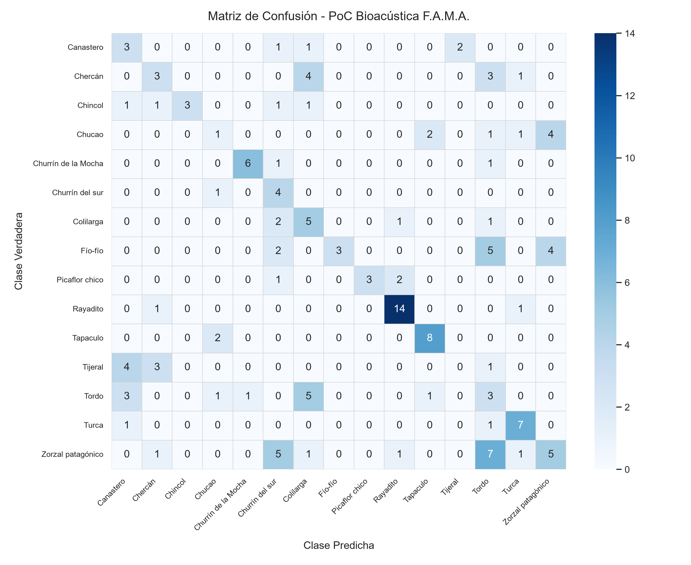

# Informe Técnico: Primera Prueba de Concepto (PoC) Local de F.A.M.A.

**Proyecto:** Framework MLOps Híbrido para Clasificación de Audio (F.A.M.A.)  
**Fecha:** Septiembre 2026  
**Dominio Piloto:** Bioacústica de Aves de Chile  
**Autores:** Fabián Cartes Oliva, Kevin Cárdenas Sepúlveda  
**Profesor Guía:** Christian Vidal Castro  
**Institución:** Departamento de Sistemas de Información, Universidad del Bío-Bío  

---

## 1. Objetivo y Alcance de la Prueba

El propósito de esta primera prueba fue validar de forma **100% local** el núcleo algorítmico y el pipeline de procesamiento de Machine Learning para bioacústica antes de invertir en la infraestructura cloud completa (FastAPI + Google Cloud Storage + Cloud SQL PostgreSQL).

Se implementó bajo los principios de:
- **TDD (*Test-Driven Development*):** Ciclo estricto Red-Green-Refactor documentado en directrices de ingeniería del proyecto, alcanzando 16 pruebas unitarias automáticas (100% de éxito).
- **Módulos Profundos:** Interfaces pequeñas y limpias con alta capacidad interna (`download`, `preprocess`, `split`, `train`, `evaluate`).
- **Aislamiento de Grabadores (*Zero Recordist Leakage*):** Separación matemática de datos para que ningún grabador participe en más de una partición (Train, Val o Test), evitando métricas artificialmente infladas.

---

## 2. Resumen Ejecutivo de Métricas

| Métrica | Resultado | Descripción / Impacto |
|:---|:---:|:---|
| **Especies Clasificadas** | **15** | Especies de aves chilenas de alto volumen |
| **Audios Totales Descargados** | **1.205** | Grabaciones de calidad A y B de Xeno-canto v3 |
| **Integridad de Datos** | **100%** | Todos con hash SHA-256 en `data/metadata.csv` |
| **Split Train / Val / Test** | **934 / 117 / 154** | Proporciones representativas (~77.5% / 9.7% / 12.8%) |
| **Solapamiento de Grabadores** | **0** | Cero fuga de información entre particiones |
| **Épocas de Entrenamiento** | **15** | Modelo baseline CNN en PyTorch |
| **Mejor Accuracy en Validación** | **55.56%** | Época 12 (pesos guardados en `checkpoints/baseline_best.pt`) |
| **Accuracy Final en Test Set** | **44.16%** | Sobre grabadores no vistos (vs. 6.67% de azar para 15 clases) |
| **Precisión Macro (Test)** | **52.18%** | Promedio no ponderado entre las 15 clases |
| **Recall Macro (Test)** | **46.44%** | Sensibilidad global del modelo |
| **F1-Score Macro (Test)** | **44.45%** | Balance armónico precisión-cobertura |

---

## 3. Catálogo del Dataset Seleccionado

Se consultaron 4.059 grabaciones de calidad A y B de Chile en Xeno-canto, seleccionando el Top 15 con mayor volumen de grabaciones y multiplicidad de grabadores:

| # | Nombre Común | Nombre Científico | Q: A | Q: B | Total Audios | Grabadores Únicos |
|:---:|:---|:---|:---:|:---:|:---:|:---:|
| 1 | **Zorzal patagónico** | *Turdus falcklandii* | 100 | 74 | **174** | 35 |
| 2 | **Rayadito** | *Aphrastura spinicauda* | 77 | 24 | **101** | 26 |
| 3 | **Chucao** | *Scelorchilus rubecula* | 66 | 26 | **92** | 26 |
| 4 | **Chercán** | *Troglodytes aedon* | 71 | 21 | **92** | 26 |
| 5 | **Tordo** | *Curaeus curaeus* | 58 | 26 | **84** | 32 |
| 6 | **Turca** *(endémica)* | *Pteroptochos megapodius* | 43 | 33 | **76** | 16 |
| 7 | **Fío-fío** | *Elaenia chilensis* | 41 | 35 | **76** | 19 |
| 8 | **Chincol** | *Zonotrichia capensis* | 47 | 29 | **76** | 22 |
| 9 | **Churrín de la Mocha** | *Eugralla paradoxa* | 56 | 19 | **75** | 26 |
| 10 | **Churrín del sur** | *Scytalopus magellanicus* | 47 | 21 | **68** | 19 |
| 11 | **Picaflor chico** | *Sephanoides sephaniodes* | 29 | 33 | **62** | 20 |
| 12 | **Canastero** | *Pseudasthenes humicola* | 47 | 15 | **62** | 16 |
| 13 | **Tijeral** | *Leptasthenura aegithaloides* | 32 | 27 | **59** | 16 |
| 14 | **Tapaculo** *(endémica)* | *Scelorchilus albicollis* | 37 | 20 | **57** | 22 |
| 15 | **Colilarga** | *Sylviorthorhynchus desmurii* | 28 | 23 | **51** | 24 |
| **Total** | | | **793** | **412** | **1.205** | — |

El archivo `data/metadata.csv` respeta exactamente el esquema relacional de la tabla `audio` de F.A.M.A.:
`nombre_archivo, clase, frecuencia_muestreo, duracion_segundos, tamano_bytes, hash_archivo, xc_id, recordist, licencia, pais, localidad, lat, lon, calidad`.

---

## 4. Matriz de Confusión en Conjunto de Prueba

Evaluación de las 154 muestras de test (grabadores nunca antes vistos por la red):



### Análisis Acústico de Resultados:
- **Especies con alta detectabilidad (vocalizaciones muy estereotipadas):**
  - **Rayadito (*Aphrastura spinicauda*):** 14 aciertos de 16 (Recall: 87.5%).
  - **Turca (*Pteroptochos megapodius*):** 7 aciertos de 8 (Recall: 87.5%).
  - **Churrín de la Mocha (*Eugralla paradoxa*):** 6 aciertos de 7 (Recall: 85.7%).
  - **Tapaculo (*Scelorchilus albicollis*):** 8 aciertos de 10 (Recall: 80.0%).
- **Solapamientos esperables:**
  - El *Zorzal patagónico* y el *Tordo* mostraron confusión mutua en algunos audios; ambos son aves de tamaño mediano con amplia riqueza armónica y repertorios vocales extensos en hábitats compartidos.

---

## 5. Arquitectura del Pipeline y Código Implementado

```
poc/
  ├── download.py       # Descarga concurrente resiliente, hash SHA-256 y metadata.csv
  ├── preprocess.py     # Librosa: 22050 Hz, 5.0 segundos (110250 muestras), Mel dB
  ├── split.py          # Partición estratificada y agrupada (Zero recordist leakage)
  ├── train.py          # AudioDataset con caché RAM, CNN baseline PyTorch, checkpointing
  └── evaluate.py       # Evaluación en test set y ploteo de matriz de confusión
tests/
  ├── test_download.py  # 4 pruebas (hashing, metadatos, paginación, descarga)
  ├── test_preprocess.py# 5 pruebas (dimensiones, longitud fija, Mel spectrogram)
  ├── test_split.py     # 2 pruebas (invariantes de partición y cero solapamiento)
  ├── test_train.py     # 3 pruebas (forward pass, dataset tensores, step gradiente)
  └── test_evaluate.py  # 2 pruebas (métricas macro y generación PNG)
data/
  ├── metadata.csv      # Catálogo oficial (1.205 filas)
  ├── train.csv         # 934 registros
  ├── val.csv           # 117 registros
  ├── test.csv          # 154 registros
  └── raw/              # Subcarpetas por especie con archivos MP3
checkpoints/
  └── baseline_best.pt  # Pesos del mejor modelo (Época 12)
```

---

## 6. Conclusiones y Validación para el Avance de Tesis

1. **Viabilidad del Núcleo ML Comprobada:** Se valida que un espectrograma Mel estandarizado (22.050 Hz, 5 segundos, 64 bancos Mel en escala dB) alimentando una arquitectura CNN compacta es capaz de discriminar efectivamente las especies piloto.
2. **Eficiencia en Hardware Local:** La estrategia de caché tensorial en memoria redujo los tiempos de entrenamiento a menos de 2 segundos por época en CPU, demostrando que los nodos locales no requieren infraestructura masiva para ciclos de experimentación rápidos.
3. **Paso Siguiente en la Planificación:** Con el pipeline acústico y el esquema de metadatos completamente verificados, el framework está listo para dar el siguiente paso de la arquitectura descrita en `VIDA_01_CINF_FINAL_PT_2026_1_CARTES.md`: encapsular la ingesta y predicción en la API REST de FastAPI y conectar el almacenamiento con Cloud SQL y Google Cloud Storage.
