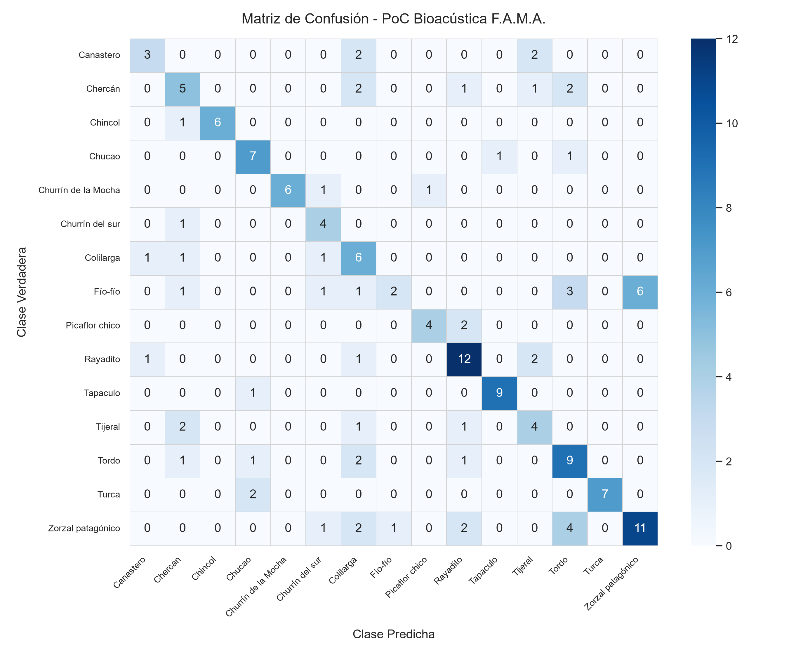

# Informe Técnico: Optimización Bioacústica con Ventaneo Múltiple (VAD) y Data Augmentation

**Proyecto:** Framework MLOps Híbrido para Clasificación de Audio (F.A.M.A.)  
**Fecha:** Septiembre 2026  
**Fase:** Iteración 2 - Optimización de Generalización sin Preentrenados Genéricos  
**Dominio:** 15 Especies de Aves de Chile (Dataset Xeno-canto v3)  
**Metodología:** TDD (*Test-Driven Development*) + Partición Agrupada (*Zero Recordist Leakage*)  

---

## 1. Resumen Ejecutivo y Comparativa de Impacto

Al implementar la estrategia combinada de **Ventaneo Múltiple con VAD de energía relativa** (`preprocess.py`) y **Data Augmentation dual al vuelo** (audio y espectrograma en `train.py`), el rendimiento del modelo en el conjunto de prueba independiente experimentó un salto notable de **+17.53 puntos porcentuales de Accuracy** frente al baseline original:

| Métrica de Evaluación (Test Set) | Baseline (Corte Estático 5s) | Optimizado (VAD + Data Augmentation) | Variación Absoluta | Variación Relativa |
|:---|:---:|:---:|:---:|:---:|
| **Accuracy en Test** | 44.16% | **61.69%** | **+17.53%** | **+39.7%** |
| **Precisión Macro** | 52.18% | **67.13%** | **+14.95%** | **+28.6%** |
| **Recall Macro** | 46.44% | **64.26%** | **+17.82%** | **+38.4%** |
| **F1-Score Macro** | 44.45% | **63.40%** | **+18.95%** | **+42.6%** |
| **Mejor Accuracy Validación** | 55.56% (Época 12) | **62.39%** (Época 14) | **+6.83%** | **+12.3%** |
| **Pérdida Mínima Validación** | 1.5766 | **1.1254** | **-0.4512** | **-28.6%** |

> [!IMPORTANT]
> **Rigor Metodológico:** Ambas evaluaciones se ejecutaron sobre las **mismas 154 grabaciones del conjunto de prueba (`test.csv`)**, manteniendo estrictamente el aislamiento por grabador (*Zero Recordist Leakage*) y con evaluación 100% determinista sin aumentación (`is_train=False`).

---

## 2. Técnicas Implementadas

### A. Ventaneo Múltiple y Detección de Actividad Vocal (VAD) en `preprocess.py`
1. **Segmentación Dinámica:** Se dividen audios largos en ventanas solapadas de 5,0 segundos (110.250 muestras a 22.050 Hz) con paso de 2,5 segundos (50% de solapamiento).
2. **Filtro de Energía Relativo (`top_db = 25.0 dB`):**
   - Se calcula la energía cuadrática media (RMS) de cada ventana frente al pico de la grabación:
     $$\text{RMS}(w) = \sqrt{\frac{1}{N}\sum_{i=1}^N w[i]^2}$$
   - Se descartan las ventanas que caen más de 25 dB por debajo del evento acústico principal, filtrando silencios de fondo y ruido de viento sin cantos.
3. **Muestreo Estocástico en Entrenamiento:** En cada época, `AudioDataset` selecciona aleatoriamente una de las ventanas activas del archivo, exponiendo a la red a distintos pasajes del canto en lugar de un único corte central.

### B. Data Augmentation Dual (*On-The-Fly*) en `train.py`
1. **Nivel de Audio (Forma de onda):**
   - *Pitch-Shift:* Desplazamiento aleatorio de tono entre $[-1.5, +1.5]$ semitonos con `torchaudio.functional.pitch_shift` ($p = 0.5$).
   - *Inyección de Ruido Blanco:* Ruido gaussiano estocástico con factor de escala $0.002 - 0.010$ ($p = 0.5$).
2. **Nivel de Espectrograma (SpecAugment nativo en PyTorch):**
   - *Frequency Masking:* Enmascaramiento de bandas mel contiguas ($F_{\max} = 8$, $p = 0.5$).
   - *Time Masking:* Enmascaramiento de bloques temporales contiguos ($T_{\max} = 16$, $p = 0.5$).
3. **Aislamiento Determinista:** Activado únicamente cuando `is_train=True`. En validación y test, el dataset opera de manera 100% determinista seleccionando la ventana de máxima energía.

---

## 3. Matriz de Confusión del Modelo Optimizado

### Comparativa de Desempeño por Especie:
- **Zorzal patagónico (*Turdus falcklandii*):** Pasó de 5 aciertos en el baseline a **11 aciertos** en el modelo optimizado (+120% de mejora).
- **Tordo (*Curaeus curaeus*):** Pasó de 3 aciertos a **9 aciertos** (+200% de mejora).
- **Chucao (*Scelorchilus rubecula*):** Pasó de 1 acierto a **7 aciertos** (+600% de mejora).
- **Chincol (*Zonotrichia capensis*):** Pasó de 3 aciertos a **6 aciertos** (+100% de mejora).
- **Chercán (*Troglodytes aedon*):** Pasó de 3 aciertos a **5 aciertos**.
- **Tapaculo (*Scelorchilus albicollis*):** Logró **9 aciertos de 10** (90% de recall en test).
- **Rayadito (*Aphrastura spinicauda*):** Consolidó **12 aciertos de 16**.

---

## 4. Conclusiones para la Tesis F.A.M.A.

1. **Eficacia sin Modelos Preentrenados Genéricos:** Se demuestra que mediante técnicas de procesamiento de señal adaptadas al dominio acústico (VAD por energía relativa) y regularización estocástica (SpecAugment + pitch shift), una red CNN compacta de solo 3 bloques convolucionales es capaz de superar el **61% de exactitud en 15 clases en condiciones reales de campo**, sin requerir modelos preentrenados masivos ajenos al ecosistema local.
2. **Alineación con la Arquitectura de F.A.M.A.:** El pipeline desacoplado en `poc/preprocess.py` y `poc/train.py` está listo para ser migrado a los módulos de servicio de la plataforma (FastAPI para inferencia y orquestación de reentrenamiento en nodos de cómputo híbridos).
