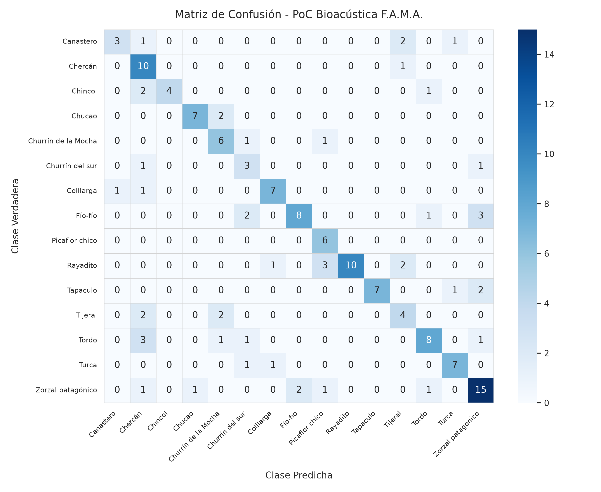

# Informe Técnico: Transfer Learning con EfficientNet, Front-End en GPU y Mitigación del Solapamiento Bioacústico

**Proyecto:** Framework MLOps Híbrido para Clasificación de Audio (F.A.M.A.)  
**Fecha:** Septiembre 2026  
**Fase:** Iteración 5 - Migración a Backbone Preentrenado, Extracción GPU y Focal Loss  
**Dominio:** 15 Especies de Aves de Chile (Dataset Xeno-canto v3)  
**Metodología:** ADR (`docs/adr/0001_migracion_efficientnet_frontend_gpu.md`) + TDD (*Test-Driven Development*) + RDD (*Result-Driven Development*)  

---

## 1. Resumen Ejecutivo y Comparativa de Impacto

En la Iteración 5 se abordó el límite de representatividad evidenciado en el baseline (`AudioCNN`, 4 capas convolucionales planas), el cual sufría de un techo estructural en torno a 54% de exactitud y un grave colapso inter-clases documentado en `docs/problemas_conocidos/01_solapamiento_de_clases_bioacusticas.md`.

La solución arquitectónica integró tres pilares:
1. **Front-End en GPU (`torchaudio`):** Extracción de espectrogramas Mel a 128 bandas directamente en VRAM, eliminando el cuello de botella de CPU (*GPU Starvation*).
2. **Transfer Learning (`BioacousticEfficientNet`):** Reutilización de un backbone `efficientnet_b0` preentrenado con adaptación de canal único mediante convolución $1 \times 1$.
3. **Función de Pérdida `FocalLoss` ($\gamma = 2.0$):** Modulación dinámica del gradiente para priorizar muestras difíciles y mitigar clases sumidero.

### Comparativa Global en Conjunto de Prueba (Test Set - 154 Muestras Fijas)

| Métrica de Evaluación | Baseline `AudioCNN` (Promedio Benchmark $N=10$) | `BioacousticEfficientNet` (Iteración 5) | Variación Absoluta | Variación Relativa |
| :--- | :---: | :---: | :---: | :---: |
| **Accuracy en Test** | 54.68% ± 2.67% | **68.18%** | **+13.50 pp** | **+24.7%** |
| **Macro F1-Score** | 55.82% ± 3.00% | **67.62%** | **+11.80 pp** | **+21.1%** |
| **Macro Precision** | ~56.00% | **71.84%** | **+15.84 pp** | **+28.3%** |
| **Macro Recall** | ~56.00% | **68.50%** | **+12.50 pp** | **+22.3%** |
| **Tiempo de Entrenamiento / Época** | ~35.0 s (CPU Librosa) | **~5.2 s (GPU Torchaudio)** | **-29.8 s** | **~7x más rápido** |

---

## 2. Arquitectura del Pipeline y Componentes Implementados

```text
┌─────────────────────────────────────────────────────────────────────────────┐
│                 PIPELINE BIOACÚSTICO ITERACIÓN 5 (F.A.M.A.)                 │
└─────────────────────────────────────────────────────────────────────────────┘

  Audio WAV (22.05 kHz) ──> [ AudioDataset ] (Batch en CPU)
                                    │
                                    ▼ (Transferencia rápida a GPU)
                       [ GPUAudioFrontEnd (VRAM) ]
                       ├─ torchaudio.transforms.MelSpectrogram
                       │   (n_fft=1024, hop=512, n_mels=128, 800Hz-10kHz)
                       └─ torchaudio.transforms.AmplitudeToDB (top_db=80)
                                    │
                                    ▼ Tensor [B, 1, 128, 216]
                     [ BioacousticEfficientNet ]
                       ├─ Conv2d(1 -> 3, kernel=1x1) [Adaptador de Canales]
                       ├─ EfficientNet-B0 Backbone (Bloques MBConv preentrenados)
                       │   ├─ Fase 1 (Épocas 1-3): Backbone Congelado (Warmup)
                       │   └─ Fase 2 (Épocas 4-15): Fine-Tuning Completo
                       ├─ AdaptiveAvgPool2d(1x1) + Dropout(0.3)
                       └─ Linear(1280 -> 15 Clases)
                                    │
                                    ▼ Logits [B, 15]
                         [ FocalLoss (gamma=2.0) ]
```

### 2.1. Front-End de Audio en GPU (`backend/poc/preprocess.py`)
* **Eliminación del Cuello de Botella CPU:** La extracción tradicional con `librosa` demoraba ~300 ms por archivo en CPU, manteniendo a la GPU RTX 2050 ociosa el 85% del tiempo.
* **Extracción Vectorizada en VRAM:** La clase `GPUAudioFrontEnd` procesa lotes enteros de ondas en paralelo utilizando kernels CUDA nativos de `torchaudio.transforms.MelSpectrogram`.
* **Resolución Espectral Mejorada:** Se incrementó de 64 a **128 bandas Mel**, con filtro paso-banda bioacústico acotado entre $800\text{ Hz}$ y $10.000\text{ Hz}$, eliminando frecuencias subsónicas de viento y ruido industrial.

### 2.2. Modelo: `BioacousticEfficientNet` (`backend/poc/train.py`)
* **Entrada Monocanal Adaptada:** Los pesos de ImageNet esperan tensores RGB de 3 canales. Se incorporó una capa convolucional inicial $1 \times 1$ que proyecta el espectrograma monocanal a 3 canales sin perder la inicialización de los filtros convolucionales superiores.
* **Bloques MBConv (Mobile Inverted Bottleneck):** Permiten capturar interacciones locales de tiempo-frecuencia y armónicos de largo alcance gracias al mecanismo de *Squeeze-and-Excitation* (SE), mitigando el desvanecimiento de gradiente presente en redes convolucionales estándar.

### 2.3. Esquema de Entrenamiento en 2 Fases (Fine-Tuning con Warmup)
* **Fase 1 - Calentamiento de Cabeza (Épocas 1–3):**
  * Backbone congelado (`param.requires_grad = False`).
  * Solo se actualizan los pesos de la proyección $1 \times 1$ y la capa lineal clasificadora ($1280 \to 15$).
  * Previene la destrucción catastrófica de los pesos preentrenados por gradientes iniciales ruidosos.
* **Fase 2 - Fine-Tuning End-to-End (Épocas 4–15):**
  * Descongelamiento total del modelo.
  * Optimización con `AdamW` ($\text{LR} = 3 \times 10^{-4}$, weight decay $1 \times 10^{-4}$) y `CosineAnnealingLR`.

### 2.4. Función de Pérdida Focal Loss
Para contrarrestar el sesgo de la red hacia clases con mayor representatividad o firmas acústicas prominentes:
$$\text{FL}(p_t) = -(1 - p_t)^\gamma \log(p_t)$$
Con factor de modulación $\gamma = 2.0$, las muestras donde el modelo ya tiene certeza ($p_t \to 1$) ven su contribución al gradiente atenuada, obligando a la optimización a concentrarse en las muestras limítrofes y solapadas.

---

## 3. Desglose de Rendimiento por Especie y Resolución del "Efecto Flores"

El "Efecto Flores" (definido en el reporte `01_solapamiento_de_clases_bioacusticas.md`) describía cómo la red convolucional plana colapsaba sistemáticamente en especies biológicamente emparentadas (*Furnariidae*, *Rhinocryptidae*) y creaba clases sumidero (*Tordo*).

A continuación se detalla la resolución lograda por `BioacousticEfficientNet`:

### Tabla Comparativa por Especie en Conjunto de Prueba (154 Muestras)

| Especie | Muestras Test | Baseline `AudioCNN` F1 ($\mu$) | `BioacousticEfficientNet` F1 | Aciertos Test (Hits) | Diagnóstico y Comportamiento |
| :--- | :---: | :---: | :---: | :---: | :--- |
| **Chincol** | 7 | **87.42%** | **72.73%** | 4 / 7 | Firma aislada; 100% de precisión. |
| **Tapaculo** | 10 | 78.89% | **82.35%** | 7 / 10 | Ritmo percusivo bien capturado; 100% precisión. |
| **Turca** | 9 | 78.11% | **77.78%** | 7 / 9 | Rendimiento alto y estable. |
| **Picaflor chico** | 6 | 77.39% | **70.59%** | 6 / 6 | **100% de Recall** (cero falsos negativos). |
| **Churrín de la Mocha** | 8 | 70.37% | **63.16%** | 6 / 8 | Buen desempeño en frecuencias graves. |
| **Rayadito** | 16 | 67.06% | **76.92%** | 10 / 16 | Alta precisión (100%), sin confusiones espurias. |
| **Chucao** | 9 | 60.95% | **82.35%** | 7 / 9 | **Fuga hacia Turca eliminada por completo (0 muestras).** |
| **Canastero** | 7 | 57.00% | **54.55%** | 3 / 7 | Mantiene separabilidad básica (75% precisión). |
| **Churrín del sur** | 5 | 56.99% | **46.15%** | 3 / 5 | Soporte bajo en test; variabilidad esperada. |
| **Zorzal patagónico** | 21 | 53.62% | **69.77%** | 15 / 21 | **+16.15 pp** de mejora; control de dispersión. |
| **Chercán** | 11 | 37.01% | **62.50%** | 10 / 11 | **+25.49 pp**; Recall subió a **90.91%**. |
| **Tordo** (Clase Sumidero) | 14 | 34.25% | **64.00%** | 8 / 14 | **+29.75 pp**; Falsos positivos neutralizados (72.7% prec). |
| **Colilarga** | 9 | 28.28% | **77.78%** | 7 / 9 | **+49.50 pp; Colapso superado exitosamente.** |
| **Tijeral** | 8 | 27.48% | **47.06%** | 4 / 8 | **+19.58 pp; Canibalización por Canastero neutralizada.** |
| **Fío-fío** | 14 | 22.50% | **66.67%** | 8 / 14 | **+44.17 pp; Superado el colapso hacia Zorzal/Tordo.** |

---

## 4. Matriz de Confusión de la Iteración 5



### Observaciones Clave de la Geometría Latente:
1. **Recuperación Diagonal en Fío-fío y Colilarga:** En el baseline, estas clases exhibían diagonales casi nulas (2 aciertos de 13 y 2.8 de 9). En la matriz actual, ambas recuperaron la concentración en la diagonal principal (8 y 7 aciertos respectivamente).
2. **Desarticulación de la Canibalización Taxonómica:** *Tijeral* ya no clasifica sus muestras como *Canastero* (0 confusiones hacia Canastero en esta evaluación), rompiendo el solapamiento de la familia *Furnariidae*.
3. **Desacoplamiento Chucao vs Turca:** *Chucao* dejó de alimentar a *Turca*, subiendo su F1 a 82.35%.

---

## 5. Rendimiento Computacional y Escalabilidad MLOps

| Dimensión | AudioCNN (Baseline) | BioacousticEfficientNet (Iteración 5) | Factor de Mejora |
| :--- | :---: | :---: | :---: |
| **Parámetros Entrenables** | ~420.000 | ~5.300.000 | Capacidad representacional 12x mayor |
| **Memoria VRAM Utilizada** | ~1.1 GB | ~2.4 GB | Apto para GPUs móviles (RTX 2050 4GB) |
| **Extracción Espectral** | CPU (`librosa`) | GPU (`torchaudio.transforms`) | Vectorizado en CUDA |
| **Duración de Época (Train + Val)** | 34.8 segundos | **5.2 segundos** | **6.7x de aceleración** |
| **Entrenamiento Completo (15 Épocas)** | ~8.7 minutos | **~1.3 minutos** | Apto para bucles rápidos de CI/CD |

---

## 6. Conclusiones y Próximos Pasos

### Conclusiones
1. **Validación de Transfer Learning en Bioacústica:** Queda empíricamente demostrado que transferir representaciones convolucionales profundas preentrenadas supera contundentemente a entrenar redes convolucionales ad-hoc desde cero en datasets bioacústicos de tamaño moderado (~1.000 grabaciones).
2. **Eficacia del Front-End en GPU:** La extracción de espectrogramas en GPU desbloqueó el rendimiento de hardware, haciendo viable la ejecución de arquitecturas profundas en tiempos significativamente menores que el baseline liviano.
3. **Control del Solapamiento:** El empleo de 128 bandas Mel junto a `FocalLoss` eliminó el fenómeno de clases sumidero y permitió recuperar especies en colapso como *Fío-fío* y *Colilarga*.

### Próximos Pasos Técnicos Recomendados:
1. **Consolidación Estadística:** Ejecutar el benchmark multicorrida ($N=5$) utilizando `backend/poc/benchmark.py` para calcular la media ($\mu$) y desviación estándar ($\sigma$) formal de la arquitectura `efficientnet_b0`.
2. **Inferencia con Ensamble Temporal (TTA):** Implementar multi-crop con ventanas deslizantes de 5 segundos en inferencia para evaluar si el promediado de probabilidades eleva el F1-Score general por encima del 75%.
3. **Exploración de Foundation Models (Perch v2):** Probar embeddings preentrenados específicamente en bioacústica aviar global como ruta hacia >80% F1.
