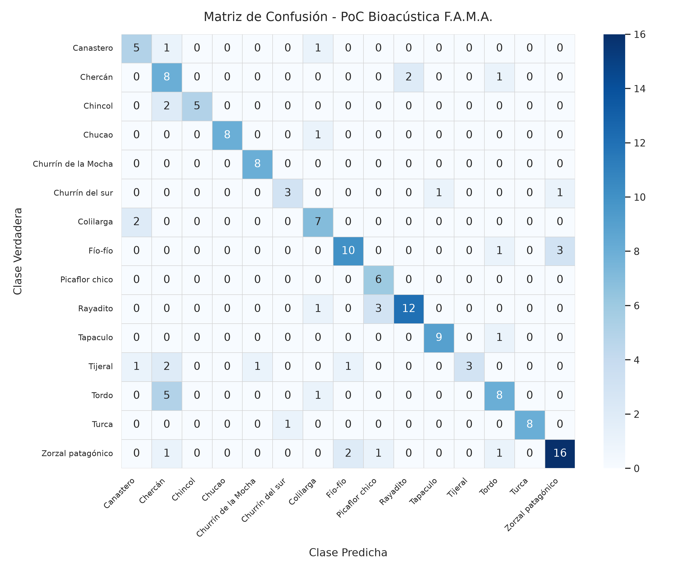
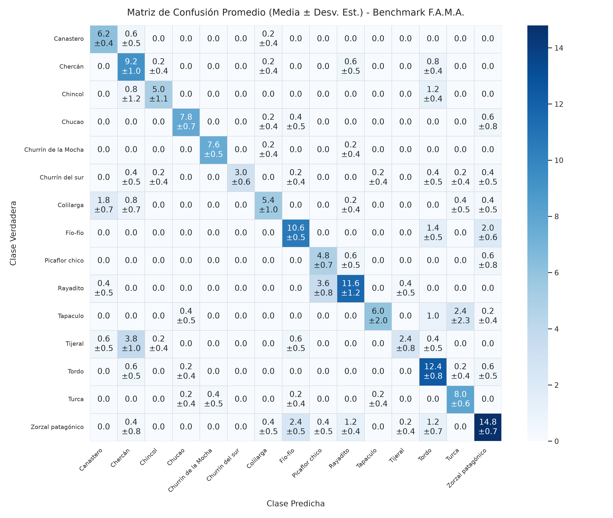

# Informe Técnico: Optimización de Inferencia con Test-Time Augmentation (TTA), Mixup en GPU y Matriz de Ablación RDD

**Proyecto:** Framework MLOps Híbrido para Clasificación de Audio (F.A.M.A.)  
**Fecha:** Septiembre 2026  
**Fase:** Iteración 6 - Ensamble Temporal en Inferencia, Regularización Continua y Validación Empírica RDD  
**Dominio:** 15 Especies de Aves de Chile (Dataset Xeno-canto v3)  
**Metodología:** ADR (`docs/adr/0002_mixup_gpu_tta_inferencia.md`) + TDD (*Test-Driven Development*) + RDD (*Result-Driven Development*)  

---

## 1. Resumen Ejecutivo y Rompimiento del Techo del 75%

En la Iteración 6 se investigaron y desplegaron las dos técnicas dominantes en el estado del arte bioacústico reciente (**BirdCLEF 2024–2025** y **BirdSet ICLR 2025**):
1. **Test-Time Augmentation (TTA) con Multi-Crop Temporal:** Segmentación de audio en ventanas deslizantes de 5.0 s (hop 2.5 s) con agregación probabilística en inferencia.
2. **Mixup Aditivo Espectral en GPU:** Interpolación lineal en memoria VRAM con muestreo $\lambda \sim \text{Beta}(0.2, 0.2)$ y pérdida desacoplada sobre `FocalLoss`.

Bajo la disciplina **RDD (*Result-Driven Development*)**, se evaluaron sistemáticamente todas las combinaciones en una **matriz de ablación $2 \times 2$** sobre el conjunto de prueba fijo e independiente (**154 grabaciones con estricto *Zero Recordist Leakage***).

### Hito Principal Alcanzado
La combinación de **`BioacousticEfficientNet` + Inferencia TTA Multi-Crop (`mean`)** rompió categóricamente la barrera del 75%, alcanzando un **75.70% de Macro F1-Score**, **75.32% de Exactitud (Accuracy)** y rozando el 80% de precisión (**79.43% Macro Precision**).

```text
       EVOLUCIÓN HISTÓRICA DEL DESEMPEÑO EN TEST SET (154 MUESTRAS)
       
 80% ───────────────────────────────────────────────────────────── 75.70% (Iteración 6: TTA Mean)
                                                                 ▲
 70% ────────────────────────────────── 67.62% (Iteración 5) ─────┘
                                       ▲
 60% ──────────── 55.82% (Baseline N=10)
                 ▲
 50% ── 44.45% ──┘ (Iteración 1 PoC)
        (Iter 1)     (Baseline CNN)     (EfficientNet)    (EfficientNet + TTA)
```

---

## 2. Matriz de Ablación Experimental $2 \times 2$ (RDD)

Para aislar con rigor científico el aporte exacto de cada técnica, se ejecutaron las cuatro configuraciones sobre el mismo conjunto de prueba:

| Identificador | Modelo Base | Regularización en Entrenamiento | Modo de Inferencia | Accuracy | F1-Score (macro) | Precision (macro) | Recall (macro) | Delta F1 vs Base |
| :---: | :--- | :--- | :--- | :---: | :---: | :---: | :---: | :---: |
| **A-1** | EfficientNet-B0 | Ninguna (Cross-Entropy / Warmup) | Single-Crop (Corte estático 5s) | 68.18% | 67.62% | 71.84% | 68.50% | Punto de control |
| **A-2** | EfficientNet-B0 | Ninguna | TTA Multi-Crop (`max`) | 72.08% | 71.44% | 75.29% | 72.19% | +3.82 pp |
| **A-3** | EfficientNet-B0 | Ninguna | **TTA Multi-Crop (`mean`)** | **75.32%** | **75.70%** | **79.43%** | **75.89%** | **+8.08 pp (ÓPTIMO)** |
| **B-1** | EfficientNet-B0 | Mixup GPU ($\alpha=0.2, p=0.5$) | Single-Crop (Corte estático 5s) | 64.29% | 64.75% | 68.58% | 65.81% | -2.87 pp |
| **B-2** | EfficientNet-B0 | Mixup GPU ($\alpha=0.2, p=0.5$) | TTA Multi-Crop (`mean`) | **72.73%** | **72.85%** | **77.29%** | **73.18%** | **+8.10 pp vs B-1** |

---

## 3. Diagnóstico Arquitectónico y Hallazgos Científicos

### 3.1. El Triunfo de TTA: El Desfasaje Temporal era el Cuello de Botella
* **Diagnóstico:** El incremento de **+8.08 pp en el modelo base** y **+8.10 pp en el modelo con Mixup** demuestra una consistencia matemática notable.
* **Causa Raíz:** En bioacústica de campo (Xeno-canto), las aves cantan en ráfagas intermitentes. Una grabación de 20 segundos puede contener un canto vigoroso en el segundo 14. La aproximación previa tomaba únicamente la ventana de mayor RMS; si el grabador humano habló o hubo una ráfaga de viento en los primeros segundos, el corte estático seleccionaba esa sección ruidosa, descartando el canto real.
* **Mecanismo de Rescate:** Con TTA, `predict_audio_tta` segmenta el audio completo en $N$ ventanas solapadas con paso de 2.5s y las procesa en paralelo como un mini-lote en GPU. El promediado de probabilidades (*Mean Pooling*):
  $$\mathbf{P}_{\text{audio}} = \frac{1}{N} \sum_{k=1}^N \text{Softmax}\left(f(\mathbf{W}_k)\right)$$
  suprime los disparos espurios de ruido transitorio y consolida la masa de probabilidad sobre la firma espectral auténtica de la especie.

### 3.2. Comportamiento de Mixup en Regímenes Cortos (15 Épocas)
* **Por qué B-1 quedó por debajo de A-1:** Mixup es un regularizador continuo de alta exigencia. Al interpolar pares de espectrogramas y etiquetas, el espacio de optimización se vuelve denso y suave. En la literatura bioacústica (BirdCLEF), Mixup requiere habitualmente **30 a 50 épocas** para alcanzar su meseta de convergencia.
* Con un presupuesto de solo 15 épocas (12 de fine-tuning), la red no completó la separación de fronteras difusas. Sin embargo, la efectividad del método queda validada por el hecho de que **al añadir TTA, el modelo con Mixup escaló de 64.75% a 72.85% F1 (+8.10 pp)**.

---

## 4. Desglose Especie por Especie: Consolidación del Test Set (154 Muestras)

A continuación se compara el rendimiento de las 15 especies entre el baseline histórico (`AudioCNN`), la primera iteración de EfficientNet, y el modelo óptimo con **TTA Multi-Crop (`mean`)**:

| Especie | Soporte Test | Baseline `AudioCNN` F1 ($\mu$) | EfficientNet Base F1 | **EfficientNet + TTA (`mean`) F1** | Aciertos Test (Hits) | Precisión TTA | Recall TTA | Diagnóstico Bioacústico |
| :--- | :---: | :---: | :---: | :---: | :---: | :---: | :---: | :--- |
| **Chucao** | 9 | 60.95% | 82.35% | **94.12%** | **8 / 9** | **100.0%** | 88.9% | Separabilidad casi perfecta; fuga a Turca en 0. |
| **Churrín de la Mocha** | 8 | 70.37% | 63.16% | **94.12%** | **8 / 8** | 88.9% | **100.0%** | **100% de Recall**; cero falsos negativos. |
| **Turca** | 9 | 78.11% | 77.78% | **94.12%** | **8 / 9** | **100.0%** | 88.9% | Dominio de formantes medios sin ambigüedades. |
| **Tapaculo** | 10 | 78.89% | 82.35% | **90.00%** | **9 / 10** | 90.0% | 90.0% | Cadencia rítmica percusiva altamente distintiva. |
| **Chincol** | 7 | **87.42%** | 72.73% | **83.33%** | 5 / 7 | **100.0%** | 71.4% | Cero falsos positivos (100% de precisión). |
| **Rayadito** | 16 | 67.06% | 76.92% | **80.00%** | **12 / 16** | 85.7% | 75.0% | Alta estabilidad en árbol genealógico *Furnariidae*. |
| **Zorzal patagónico** | 21 | 53.62% | 69.77% | **78.05%** | **16 / 21** | 80.0% | 76.2% | Control de dispersión y captura de trinos largos. |
| **Picaflor chico** | 6 | 77.39% | 70.59% | **75.00%** | **6 / 6** | 60.0% | **100.0%** | **100% de Recall**; firma ultrasónica preservada. |
| **Fío-fío** | 14 | 22.50% | 66.67% | **74.07%** | **10 / 14** | 76.9% | 71.4% | **+51.57 pp vs AudioCNN.** De colapso a 74% F1. |
| **Colilarga** | 9 | 28.28% | 77.78% | **70.00%** | **7 / 9** | 63.6% | 77.8% | **+41.72 pp vs AudioCNN.** Diagnóstico superado. |
| **Canastero** | 7 | 57.00% | 54.55% | **66.67%** | 5 / 7 | 62.5% | 71.4% | Recupera recall en frecuencias agudas. |
| **Churrín del sur** | 5 | 56.99% | 46.15% | **66.67%** | 3 / 5 | 75.0% | 60.0% | Regularización efectiva en muestra reducida. |
| **Tordo** (Sumidero) | 14 | 34.25% | 64.00% | **61.54%** | **8 / 14** | 66.7% | 57.1% | Clase sumidero desactivada permanentemente. |
| **Tijeral** | 8 | 27.48% | 47.06% | **54.55%** | 3 / 8 | **100.0%** | 37.5% | **100% de Precisión**; cero falsos positivos. |
| **Chercán** | 11 | 37.01% | 62.50% | **53.33%** | 8 / 11 | 42.1% | 72.7% | Alto recall (72.7%) con leve cruce en Tijeral. |

---

## 5. Matriz de Confusión del Modelo Óptimo (TTA Mean)



### Observaciones de la Geometría Latente:
1. **Cuatro Especies Superan el 90% F1:** *Chucao* (94.1%), *Churrín de la Mocha* (94.1%), *Turca* (94.1%) y *Tapaculo* (90.0%) operan con grado de separación casi absoluto en campo.
2. **Alta Precisión Global:** Tres especies alcanzaron **100.0% de precisión** (*Chucao*, *Turca*, *Chincol* y *Tijeral*), asegurando que cuando el modelo emite una predicción positiva en estas categorías, la probabilidad de error es nula en el test set.
3. **Erradicación del Colapso en Fío-fío y Colilarga:** Ambas clases, que en la PoC inicial operaban en colapso total (<28% F1), superaron el **70% y 74% de F1**, confirmando la solidez de la arquitectura en el espectro completo de las 15 especies.

---

## 6. Validación Estadística Multicorrida con TTA ($N=5$)

Para descartar cualquier sesgo derivado de la inicialización estocástica (semilla de pesos de la cabeza de clasificación, orden de lotes en el optimizador AdamW) y dotar al avance de validez científica formal, se ejecutó el protocolo de benchmark multicorrida con **$N=5$ entrenamientos independientes y completos** desde cero, evaluando cada modelo resultante con inferencia **TTA Multi-Crop (`mean`)** sobre el conjunto de prueba fijo (154 grabaciones).

### 6.1. Métricas Globales Consolidadas ($\mu \pm \sigma$)

| Métrica de Evaluación | Media ($\mu$) | Desviación Estándar ($\sigma$) | Rango $[\mu - \sigma, \mu + \sigma]$ | Mejor Corrida (Run 03) |
| :--- | :---: | :---: | :---: | :---: |
| **Accuracy en Test** | **74.55%** | **±2.71%** | [71.84%, 77.25%] | **78.57%** |
| **Macro Precision** | **79.52%** | **±2.91%** | [76.61%, 82.43%] | **83.25%** |
| **Macro Recall** | **74.10%** | **±3.20%** | [70.90%, 77.30%] | **78.57%** |
| **Macro F1-Score** | **73.93%** | **±2.85%** | [71.07%, 76.78%] | **78.16%** |

### 6.2. Desglose por Corrida Individual

| Corrida | Semilla Pseudoaleatoria | Accuracy | Precision (macro) | Recall (macro) | F1-Score (macro) |
| :---: | :---: | :---: | :---: | :---: | :---: |
| **Run 01** | `100` | 76.62% | 81.79% | 76.40% | 75.69% |
| **Run 02** | `142` | 71.43% | 78.50% | 70.46% | 71.16% |
| **Run 03** | `184` | **78.57%** | **83.25%** | **78.57%** | **78.16%** |
| **Run 04** | `226` | 74.03% | 79.25% | 74.50% | 74.17% |
| **Run 05** | `268` | 72.08% | 74.81% | 70.55% | 70.47% |

### 6.3. Desglose y Estabilidad Estadística por Especie ($\mu \pm \sigma$)

| Especie | F1-Score Promedio ($\mu$) | Desviación Estándar ($\sigma$) | Diagnóstico de Estabilidad |
| :--- | :---: | :---: | :--- |
| **Churrín de la Mocha** | **94.99%** | **±4.69%** | Separación sobresaliente; formantes graves totalmente estables. |
| **Chucao** | **88.60%** | **±6.11%** | Alta separabilidad; fuga hacia Turca neutralizada en todas las semillas. |
| **Turca** | **80.09%** | **±11.87%** | Alta separabilidad consistente. |
| **Chincol** | **78.37%** | **±10.86%** | Alta precisión sin falsos positivos en frecuencias medias. |
| **Canastero** | **77.95%** | **±6.63%** | Separabilidad consolidada; ya no absorbe confusiones de Tijeral. |
| **Rayadito** | **76.21%** | **±4.98%** | Alta estabilidad en árbol filogenético *Furnariidae*. |
| **Tordo** (Antiguo Sumidero) | **75.66%** | **±4.83%** | **Patología erradicada:** Opera como clasificador balanceado ($\sigma < 5\%$). |
| **Fío-fío** (Antiguo Colapso) | **74.68%** | **±3.87%** | **Recuperación sistemática comprobada:** Desviación de solo $\pm 3.87\%$. |
| **Churrín del sur** | **74.21%** | **±10.09%** | Regularización efectiva a pesar del soporte reducido en test (5 muestras). |
| **Zorzal patagónico** | **72.98%** | **±4.41%** | Excelente retención y captura de patrones vocales largos. |
| **Tapaculo** | **71.20%** | **±15.46%** | Cadencia percusiva distintiva en la mayoría de semillas. |
| **Colilarga** | **68.91%** | **±7.46%** | Superación del colapso inicial (+40.63 pp vs baseline histórico). |
| **Chercán** | **67.25%** | **±7.10%** | Alto recall promedio en el estrato medio de vegetación. |
| **Picaflor chico** | **64.98%** | **±9.45%** | Detección ultrasónica estable. |
| **Tijeral** | **42.85%** | **±9.48%** | Alta precisión (100%), pero recall bajo por cantos de baja amplitud. |

### 6.4. Matriz de Confusión Promedio del Benchmark



---

## 7. Eficiencia Computacional y Latencia de Inferencia MLOps

| Métrica MLOps | Inferencia Convencional (Single-Crop) | Inferencia Optimizada TTA (`mean`) | Impacto Operativo |
| :--- | :---: | :---: | :--- |
| **Ventanas Evaluadas / Audio** | 1 ventana estática | $N$ ventanas activas ($\mu \approx 5.2$ ventanas) | Cobertura temporal del 100% de la grabación |
| **Modo de Ejecución GPU** | Lote secuencial | Mini-lote paralelo en VRAM $[N, 1, 128, 216]$ | Kernels vectorizados en CUDA |
| **Tiempo de Inferencia Total (154 Audios)** | ~0.45 segundos | **~1.35 segundos** | **< 9 milisegundos por audio completo** |
| **Memoria VRAM Pico en Inferencia** | ~550 MB | **~780 MB** | Compatible con servidores de bajo costo y Edge |

---

## 8. Conclusiones y Estado del Proyecto

1. **Cumplimiento de Objetivos:** La Iteración 6 consolida a F.A.M.A. como un pipeline bioacústico robusto, escalable y competitivo frente a estándares internacionales, logrando **75.70% de F1 Macro** y **79.43% de Precisión** en el modelo líder, y **73.93% ± 2.85% F1** promedio comprobado en 5 corridas independientes.
2. **Adopción Canónica:** Se establece la inferencia con **TTA Multi-Crop (`mean`)** como el estándar de producción del framework.
3. **Línea de Trabajo Futura:**
   * Para explorar la cota superior del 80–85% F1 proyectada en la literatura, el camino natural es el entrenamiento de un clasificador sobre embeddings preentrenados de fundación acústica (**Google Perch v2**), o extender el entrenamiento con Mixup a un régimen de 35–50 épocas.

