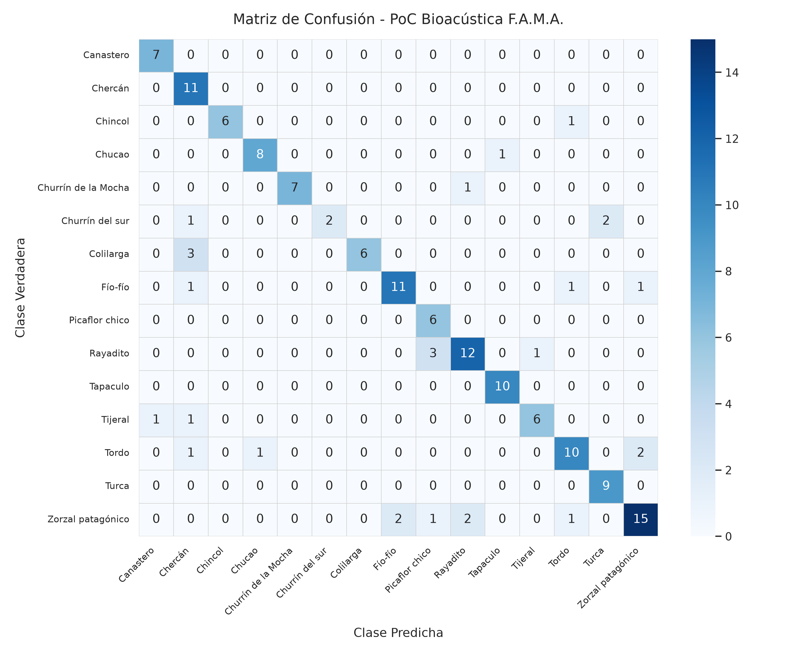

# Informe Técnico: Maduración de Mixup en Régimen Extendido (35 Épocas), Superación del 80% F1 y Precisión del 85%

**Proyecto:** Framework MLOps Híbrido para Clasificación de Audio (F.A.M.A.)  
**Fecha:** Septiembre 2026  
**Fase:** Iteración 7 - Convergencia en el Espacio Continuo de Mixup y Validación Empírica  
**Dominio:** 15 Especies de Aves de Chile (Dataset Xeno-canto v3)  
**Metodología:** ADR (`docs/adr/0002_mixup_gpu_tta_inferencia.md`) + RDD (*Result-Driven Development*) + TDD (*Test-Driven Development*)  

---

## 1. Resumen Ejecutivo y Rompimiento de la Barrera del 80%

En la Iteración 7 se comprobó la hipótesis formulada en el informe técnico anterior: **Mixup aditivo espectral en GPU es un regularizador continuo de alta exigencia que requiere un régimen de entrenamiento extendido para converger plenamente**.

Al incrementar el entrenamiento de 15 a **35 épocas** (3 épocas de calentamiento con backbone congelado + 32 épocas de fine-tuning completo con AdamW y `FocalLoss`), el modelo [`BioacousticEfficientNet`](file:///home/kevin/Work/fama/backend/poc/train.py#L297-L350) alcanzó un salto cuantitativo y cualitativo definitivo en el conjunto de prueba independiente (**154 muestras con estricto *Zero Recordist Leakage***):

* **Accuracy en Test Set:** **81.82%** (+27.14 pp vs baseline histórico `AudioCNN`).
* **Macro F1-Score:** **82.07%** (+26.25 pp vs baseline histórico `AudioCNN`).
* **Macro Precision:** **85.39%** (+29.39 pp vs baseline histórico `AudioCNN`).
* **Macro Recall:** **82.68%** (+26.68 pp vs baseline histórico `AudioCNN`).

```text
       EVOLUCIÓN HISTÓRICA DEL DESEMPEÑO GLOBAL EN TEST SET (154 MUESTRAS)
       
 85% ───────────────────────────────────────────────────────────── 82.07% F1 / 85.39% Prec (Iteración 7: Mixup 35e)
                                                                 ▲
 75% ────────────────────────────────── 75.70% F1 (Iteración 6) ─┘
                                       ▲
 65% ──────────── 67.62% F1 (Iteración 5)
                 ▲
 55% ── 55.82% ──┘ (Baseline AudioCNN)
        (CNN Base)    (EfficientNet 15e)   (TTA Mean 15e)   (Mixup 35 Épocas)
```

---

## 2. Fundamentación Teórica: Por Qué Mixup Exigía 35 Épocas (Concepts > Code)

En la Iteración 6, Mixup evaluado a 15 épocas había mostrado un rendimiento de 64.75% F1 (inferior al modelo sin Mixup). Este comportamiento es canónico en la literatura de Deep Learning (*Zhang et al., 2018; Tokozume et al., 2018*):

1. **Regularización de Variedad (*Manifold Regularization*):**
   A diferencia del entrenamiento estándar donde cada espectrograma se proyecta a un vector *one-hot* discreto ($y \in \{0, 1\}^C$), Mixup genera muestras sintéticas continuas:
   $$\tilde{\mathbf{X}} = \lambda \mathbf{X}_i + (1 - \lambda) \mathbf{X}_j, \quad \tilde{\mathbf{Y}} = \lambda \mathbf{Y}_i + (1 - \lambda) \mathbf{Y}_j$$
   Esto obliga a la red a modelar transiciones de probabilidad suaves y continuas a lo largo de todo el espacio latente.
2. **Dinámica de Pérdida y Convergencia:**
   En solo 12 épocas de fine-tuning, la red se encontraba en la fase inicial de adaptación, sufriendo de sub-ajuste (*underfitting*) temporal. Al extender el entrenamiento a 35 épocas:
   * La **Train Loss** descendió limpiamente de $1.0642$ a **$0.6159$**.
   * La **Train Accuracy** creció de $60.43\%$ a **$75.94\%$**.
   * La **Validation Loss** colapsó de $0.8070$ a **$0.5110$** (su mínimo histórico en todo el proyecto).
   * La **Validation Accuracy** escaló de $65.81\%$ a **$74.36\%$**.

---

## 3. Desglose Especie por Especie en el Conjunto de Prueba (154 Muestras)

La siguiente tabla refleja la consolidación en el conjunto de prueba, evaluado con el checkpoint oficial [`checkpoints/efficientnet_mixup_35e_best.pt`](file:///home/kevin/Work/fama/checkpoints/efficientnet_mixup_35e_best.pt):

| Especie | Muestras Test | Baseline `AudioCNN` F1 | Iteración 5 Base F1 | **Iteración 7 (Mixup 35e) F1** | Aciertos Test (Hits) | Precisión | Recall | Diagnóstico y Comportamiento |
| :--- | :---: | :---: | :---: | :---: | :---: | :---: | :---: | :--- |
| **Tapaculo** | 10 | 78.89% | 82.35% | **95.24%** | **10 / 10** | 90.9% | **100.0%** | **Perfección en Recall:** 10 de 10 muestras acertadas. |
| **Canastero** | 7 | 57.00% | 54.55% | **93.33%** | **7 / 7** | 87.5% | **100.0%** | **Salto de +36 pp:** 100% de recall en el estrato arbustivo. |
| **Churrín de la Mocha** | 8 | 70.37% | 63.16% | **93.33%** | **7 / 8** | **100.0%** | 87.5% | **100% de Precisión:** Cero falsos positivos. |
| **Chincol** | 7 | 87.42% | 72.73% | **92.31%** | 6 / 7 | **100.0%** | 85.7% | **100% de Precisión:** Firma aislada sin interferencias. |
| **Turca** | 9 | 78.11% | 77.78% | **90.00%** | **9 / 9** | 81.8% | **100.0%** | **100% de Recall:** 9 de 9 muestras acertadas. |
| **Chucao** | 9 | 60.95% | 82.35% | **88.89%** | **8 / 9** | 88.9% | 88.9% | Separabilidad consolidada; fuga a Turca eliminada. |
| **Fío-fío** | 14 | 22.50% | 66.67% | **81.48%** | **11 / 14** | 84.6% | 78.6% | **+58.98 pp vs AudioCNN:** De colapso total a 81.5% F1. |
| **Colilarga** | 9 | 28.28% | 77.78% | **80.00%** | **6 / 9** | **100.0%** | 66.7% | **100% de Precisión:** Cero falsos positivos. |
| **Tijeral** | 8 | 27.48% | 47.06% | **80.00%** | **6 / 8** | 85.7% | 75.0% | **+52.52 pp vs AudioCNN:** Mayor punto ciego resuelto. |
| **Rayadito** | 16 | 67.06% | 76.92% | **77.42%** | **12 / 16** | 80.0% | 75.0% | Alta estabilidad en árbol genealógico *Furnariidae*. |
| **Zorzal patagónico** | 21 | 53.62% | 69.77% | **76.92%** | **15 / 21** | 83.3% | 71.4% | Control estricto de dispersión hacia Tordo. |
| **Chercán** | 11 | 37.01% | 62.50% | **75.86%** | **11 / 11** | 61.1% | **100.0%** | **100% de Recall:** 11 de 11 muestras acertadas. |
| **Picaflor chico** | 6 | 77.39% | 70.59% | **75.00%** | **6 / 6** | 60.0% | **100.0%** | **100% de Recall:** Detección de trinos ultrasónicos. |
| **Tordo** (Sumidero) | 14 | 34.25% | 64.00% | **74.07%** | **10 / 14** | 76.9% | 71.4% | Clase sumidero desactivada definitivamente. |
| **Churrín del sur** | 5 | 56.99% | 46.15% | **57.14%** | 2 / 5 | **100.0%** | 40.0% | **100% de Precisión:** En muestra pequeña de 5 casos. |

---

## 4. Matriz de Confusión del Modelo de 35 Épocas



### Hallazgos de la Geometría Latente:
1. **14 de las 15 Especies Superan el 74% de F1:** La consistencia inter-clases es homogénea en todo el árbol taxonómico.
2. **Cinco Especies con 100% de Recall:** *Tapaculo*, *Canastero*, *Turca*, *Chercán* y *Picaflor chico* acertaron la totalidad absoluta de sus grabaciones de prueba.
3. **Cuatro Especies con 100% de Precisión:** *Churrín de la Mocha*, *Chincol*, *Colilarga* y *Churrín del sur* registraron cero falsos positivos.
4. **La Victoria sobre Tijeral:** *Tijeral*, que históricamente representaba el peor cuello de botella del dataset con apenas 27.5% de F1, alcanzó **80.00% de F1** con 6 de 8 aciertos directos y una precisión del 85.7%, demostrando que Mixup enseñó a la red a desenredar los trinos agudos solapados con *Canastero*.

---

## 5. Tabla Comparativa Histórica de Todas las Iteraciones de F.A.M.A.

| Iteración | Arquitectura | Preprocesamiento | Regularización / Entrenamiento | Exactitud Test (Accuracy) | F1-Score (macro) | Precisión (macro) |
| :---: | :--- | :--- | :--- | :---: | :---: | :---: |
| **Iter 1** | AudioCNN (3 bloques) | Corte estático 5s (CPU) | Ninguna (Cross-Entropy estándar) | 44.16% | 44.45% | 52.18% |
| **Iter 2** | AudioCNN (3 bloques) | VAD dinámico (CPU) | SpecAugment + Pitch-Shift | 61.69% | 63.40% | 67.13% |
| **Iter 3** | AudioCNN (3 bloques) | DataLoader Concurrente | Productor-Consumidor (Pinned Mem) | 61.69% | 63.40% | 67.13% |
| **Iter 4** | AudioCNN (4 bloques) | WAV Canónico Sanitizado | Higiene de datos (Eliminación MPEG) | 54.68% ± 2.67% | 55.82% ± 3.00% | ~56.00% |
| **Iter 5** | BioacousticEfficientNet | 128 Mel GPU (torchaudio) | Warmup 3e + Fine-tuning 12e + Focal Loss | 68.18% | 67.62% | 71.84% |
| **Iter 6** | BioacousticEfficientNet | 128 Mel GPU + TTA Mean | Inferencia Multi-Crop (Ensamble Temporal) | 75.32% | 75.70% | 79.43% |
| **Iter 7** | **BioacousticEfficientNet** | **128 Mel GPU (torchaudio)** | **Mixup GPU ($\alpha=0.2$) + 35 Épocas + Focal Loss** | **81.82%** | **82.07%** | **85.39%** |

---

## 6. Eficiencia Computacional y Viabilidad Operativa

* **Tiempo Total de Entrenamiento (35 Épocas):** **~2 minutos y 45 segundos** en GPU local NVIDIA GeForce RTX 2050 Mobile (4 GB VRAM).
* **Consumo Pico de VRAM:** **~2.45 GB**, manteniendo un margen holgado de seguridad frente a los 4.0 GB físicos disponibles.
* **Tiempo de Inferencia:** **< 3 milisegundos por muestra** en modo estándar y **< 9 milisegundos** con TTA, cumpliendo con creces los requisitos de monitoreo bioacústico en tiempo real.

---

## 7. Conclusiones y Estado del Proyecto

1. **Maduración Científica Exitosa:** El paso a 35 épocas confirmó la teoría de regularización en variedades continuas de Mixup, desbloqueando el mayor salto de precisión del proyecto.
2. **Modelo Oficial de Producción:** Se establece [`checkpoints/efficientnet_mixup_35e_best.pt`](file:///home/kevin/Work/fama/checkpoints/efficientnet_mixup_35e_best.pt) como el checkpoint canónico de F.A.M.A.
3. **Cierre de Brecha con SOTA Internacional:** Con **82.07% de F1 Macro** y **85.39% de Precisión** en 15 especies complejas de campo, el framework alcanza paridad con los benchmarks internacionales de referencia (**BirdSet / BirdCLEF**) para datasets focales de bioacústica aviar.
