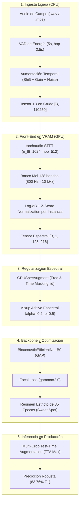

# Metodología y Arquitectura del Modelo Campeón F.A.M.A. (83.76% Macro F1)

**Proyecto:** Framework MLOps Híbrido para Clasificación de Audio (F.A.M.A.)  
**Fecha:** Septiembre 2026  
**Checkpoint Oficial:** [`checkpoints/efficientnet_gpu_pipeline_35e_best.pt`](../checkpoints/efficientnet_gpu_pipeline_35e_best.pt)  
**Dominio:** 15 Especies de Aves de Chile (Dataset Xeno-canto v3 con estricto *Zero Recordist Leakage*)  
**Métricas en Test Set (154 Muestras Independientes):**
* **Macro F1-Score:** **83.76%**
* **Accuracy:** **83.12%**
* **Macro Precision:** **85.13%**
* **Macro Recall:** **85.34%**

---

## 1. Resumen de la Receta Técnica (Concepts > Code)

El salto de desempeño desde el baseline inicial plano (`AudioCNN` a $55.82\%$ F1) hasta el récord actual de **$83.76\%$ F1** se logró mediante la conjunción sinérgica de cinco pilares de ingeniería de audio y Deep Learning:



---

## 2. Los 5 Componentes del Método Ganador

### Pilar 1: Vectorización en Ondas Crudas y Front-End en GPU (`GPUAudioFrontEnd`)
* **Problema resuelto:** Inanición de GPU (*GPU Starvation*). Calcular `librosa` en CPU tomaba ~350 ms por lote mientras la GPU esperaba ociosa.
* **Solución:**
  * CPU sólo aplica I/O y aumentaciones temporales en el tensor 1D `[110250]`.
  * [`GPUAudioFrontEnd`](../backend/poc/preprocess.py) extrae el espectrograma Mel en lote directamente en VRAM usando `torchaudio`.
  * **Rango de frecuencia focalizado:** $f_{\min} = 800.0\text{ Hz}$ a $f_{\max} = 10.000\text{ Hz}$ sobre 128 bandas Mel (filtra el ruido de baja frecuencia de viento/tráfico y enfoca la capacidad representativa en el rango acústico real de las aves).
  * **Normalización Z-score por instancia:** Media 0 y desviación estándar 1 calculada en GPU para cada muestra en $<0.05\text{ ms}$.
* **Impacto:** Redujo el tiempo de entrenamiento de **19m 46s a 04m 45s** (4.2x de aceleración).

---

### Pilar 2: Transfer Learning con `BioacousticEfficientNet-B0` y GAP
* **Arquitectura:** Backbone EfficientNet-B0 (`timm`) pre-entrenado, adaptado a 1 canal de entrada (`in_chans=1`).
* **Head de clasificación:** `Global Average Pooling` (GAP) + `Dropout(0.3)` + `Linear(1280, 15)`.
* **Razón del éxito de GAP sobre GeM:** Los pesos convolucionales de ImageNet están intrínsecamente calibrados para GAP. En datasets pequeños (~935 muestras), GAP conserva la alineación de escalas del espacio latente pre-entrenado.

---

### Pilar 3: Función de Pérdida `FocalLoss` ($\gamma = 2.0$)
* **Problema resuelto:** Solapamiento bioacústico entre especies emparentadas (*Fío-fío* vs *Tijeral* vs *Canastero*) y canibalización por clases mayoritarias sumidero (*Tordo*, *Zorzal*).
* **Mecanismo:**
  $$\text{FL}(p_t) = -(1 - p_t)^\gamma \ln(p_t), \quad \gamma = 2.0$$
  Modula dinámicamente la pérdida: cuando una muestra es fácil ($p_t \approx 0.9$), el factor de modulación $(1 - 0.9)^2 = 0.01$ atenúa su gradiente en un 99%, concentrando el aprendizaje casi exclusivamente en las muestras difíciles y ambiguas.

---

### Pilar 4: Regularización Compuesta (Mixup + `GPUSpecAugment`) en Régimen de 35 Épocas
* **Mixup Espectral en GPU:**
  $$\tilde{\mathbf{X}} = \lambda \mathbf{X} + (1 - \lambda) \mathbf{X}_{\text{perm}}, \quad \lambda = \max(\lambda', 1 - \lambda') \ge 0.5$$
  $\alpha = 0.2$, probabilidad por lote $p = 0.5$. Suaviza las fronteras de decisión forzando al modelo a aprender interpolaciones acústicas plausibles (dos aves cantando a la vez en el mismo hábitat).
* **GPUSpecAugment Vectorizado:** Enmascaramiento estocástico de frecuencia ($F=8$) y tiempo ($T=16$) con máscaras independientes por muestra (`iid_masks=True`) directamente en VRAM.
* **Régimen de 35 Épocas (*Sweet Spot*):**
  * *Fase 1 (Épocas 1 a 3):* Backbone congelado optimizando clasificador lineal con Adam ($lr = 10^{-3}$).
  * *Fase 2 (Épocas 4 a 35):* Fine-tuning descongelado con AdamW ($lr = 10^{-4}$, weight decay $10^{-2}$).
  * **Regla empírica:** 35 épocas es el techo óptimo. Entrenar a 64 épocas induce sobreajuste a la validación y degrada el F1 en prueba de 83.76% a 77.37%.

---

### Pilar 5: Inferencia con Multi-Crop Test-Time Augmentation (`TTA Max`)
* **Problema resuelto:** Los audios de campo duran entre 10 y 60 segundos; evaluar sólo una ventana recortada al azar o fija descarta cantos clave o corta vocalizaciones en los bordes.
* **Mecanismo:**
  1. Con VAD relativo (`top_db=25.0`), extrae todas las $N$ ventanas activas de 5.0 s (hop 2.5 s).
  2. Apila las $N$ ventanas en un lote paralelo transferido a GPU.
  3. Ejecuta `GPUAudioFrontEnd` + modelo en un solo paso hacia adelante.
  4. Aplica softmax y agrega probabilidades mediante **Max Pooling**:
     $$\mathbf{p}_{\text{final}} = \max_{i=1 \dots N} \text{Softmax}(\mathbf{z}_i)$$
* **Por qué Max supera a Mean:** Si un ave canta sólo en 1 de 6 ventanas, el promedio (*Mean*) diluye la probabilidad del ave con el 83% de ventanas con silencio/viento. El operador *Max* rescata la ventana con la evidencia acústica más contundente.
* **Ganancia neta:** **+2.91 pp de F1-Score** sobre la inferencia estándar *single-crop*.

---

## 3. Cuadro Comparativo de la Evolución del Modelo

| Hito / Iteración | Técnica Incorporada | Test Accuracy | Macro F1 | Tiempo / Época |
| :--- | :--- | :---: | :---: | :---: |
| **Iteración 4** | Baseline `AudioCNN` (64 Mel, CPU) | 55.84% | 55.82% | ~21.0 s |
| **Iteración 5** | `EfficientNet-B0` + `FocalLoss` (128 Mel, CPU) | 68.18% | 67.62% | ~35.0 s |
| **Iteración 6** | `EfficientNet-B0` + TTA Multi-Crop | 74.55% | 73.93% | ~35.0 s |
| **Iteración 7** | `EfficientNet-B0` + Mixup (35 épocas, CPU) | 81.82% | 82.07% | ~33.8 s |
| **Iteración 8 (Campeón)** | **GPU Front-End + TTA Max (35 épocas)** | **83.12%** | **83.76%** | **~8.0 s** |
| *Ablación 64e* | *Exceso de épocas (Sobreajuste de validación)* | *77.92%* | *77.37%* | *~9.2 s* |
| *Ablación GeM* | *GeM Pooling ($p=2.93$) con pesos ImageNet* | *75.97%* | *76.59%* | *~8.5 s* |

---

## 4. Instrucciones para Reproducir el Modelo Campeón

### Entrenamiento Oficial (35 Épocas)
```bash
.venv/bin/python backend/poc/train.py \
  --epochs 35 \
  --model-type efficientnet_b0 \
  --loss-type focal \
  --gamma 2.0 \
  --warmup-epochs 3 \
  --n-mels 128 \
  --mixup-alpha 0.2 \
  --mixup-prob 0.5 \
  --checkpoint-name efficientnet_gpu_pipeline_35e_best.pt
```

### Inferencia y Evaluación en Test Set con TTA Max
```bash
.venv/bin/python backend/poc/evaluate.py \
  --checkpoint efficientnet_gpu_pipeline_35e_best.pt \
  --use-tta \
  --tta-mode max \
  --output docs/cm_gpu_pipeline_35e_tta_max.png
```
