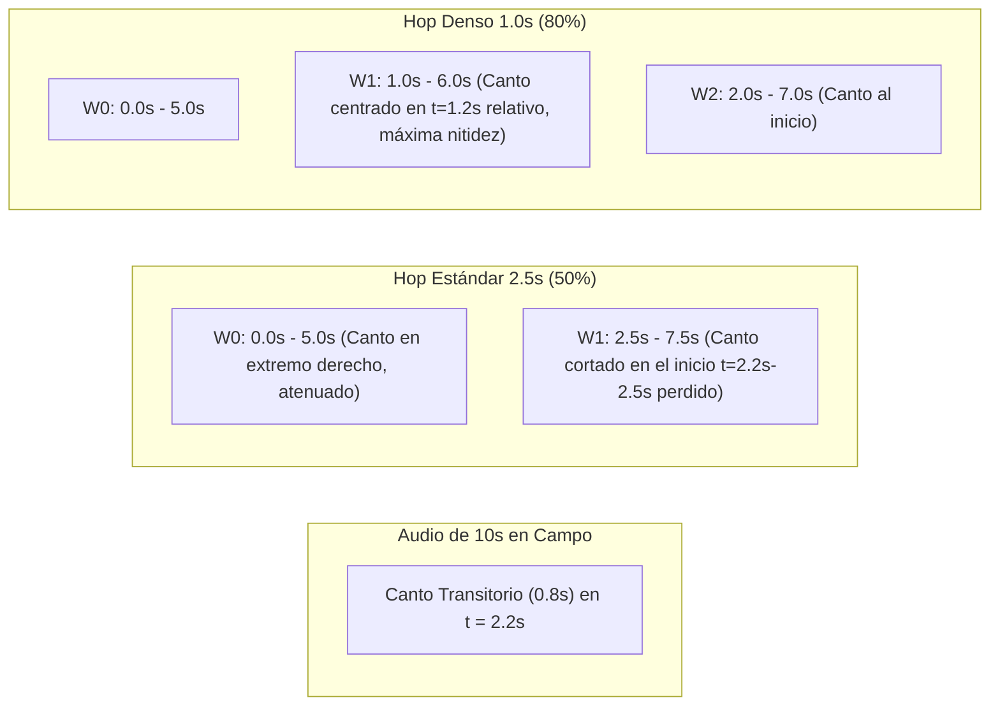

# Informe Técnico: Ventaneo Temporal Denso (Dense Windowing) en Inferencia TTA (RDD)

**Proyecto:** Framework MLOps Híbrido para Clasificación de Audio (F.A.M.A.)  
**Fecha:** Septiembre 2026  
**Fase:** Iteración 11 - Optimización de Inferencia vía Ventaneo Temporal Denso  
**Checkpoint Oficial Evaluado:** [`checkpoints/efficientnet_gpu_pipeline_35e_best.pt`](../checkpoints/efficientnet_gpu_pipeline_35e_best.pt)  
**Test Set:** 154 grabaciones independientes de Xeno-Canto v3 (*Zero Recordist Leakage*, 15 especies de aves chilenas)  
**Metodología:** ADR ([`docs/adr/0005_ventaneo_denso_hop_temporal.md`](./adr/0005_ventaneo_denso_hop_temporal.md)) + TDD (*Test-Driven Development*) + RDD (*Result-Driven Development*)  

---

## 1. Resumen Ejecutivo y Nuevo Récord del Proyecto

En la Iteración 11 se implementó y validó empíricamente la técnica de **Ventaneo Temporal Denso (*Dense Windowing*)** en inferencia con Test-Time Augmentation (TTA).

El objetivo central consistió en erradicar la **bisección temporal y la atenuación de borde** de las vocalizaciones diagnósticas de aves silvestres (eventos acústicos breves de 0.4 a 1.5 segundos) mediante la reducción del salto entre ventanas consecutivas (*hop*) de 2.5s (50% de solapamiento) a 1.25s (75% solapamiento) y 1.00s (80% solapamiento).

### Resultado Principal:
> [!IMPORTANT]
> **¡NUEVO RÉCORD HISTÓRICO DEL PROYECTO F.A.M.A.!**  
> La configuración **Ventaneo Denso con Hop de 1.00s y Agregación TTA Max** superó la marca histórica previa del proyecto, alcanzando:
> * **Macro F1-Score:** **84.38%** (vs 83.76% anterior, **+0.62 pp**)
> * **Macro Precision:** **85.56%** (vs 85.13% anterior, **+0.43 pp**)
> * **Macro Recall:** **84.85%**
> * **Accuracy:** **83.12%**
> * **Costo de Reentrenamiento:** **0 horas / 0 épocas** (*Zero Retraining Cost*, optimización pura de tiempo de inferencia).

---

## 2. Motivación Teórica y Física Bioacústica

### 2.1 Naturaleza Transitoria del Canto de Aves Silvestres
A diferencia de señales estacionarias o del habla humana continua, las vocalizaciones de aves passeriformes (como *Elaenia albiceps* - Fío-fío, *Scytalopus magellanicus* - Churrín del sur, o *Sylviorthorhynchus desmursii* - Tijeral) se estructuran en ráfagas de trinos o sílabas discretas de muy corta duración (entre 0.4 y 1.5 segundos).

### 2.2 Patología del Hop Espaciado (2.5s / 50% Overlap)
En una ventana fija de 5.0 segundos con un salto temporal estándar de 2.5 segundos:
1. **Bisección de Frases Vocales:** Si un canto diagnóstico ocurre entre el segundo 2.0 y 2.9, queda truncado o fragmentado en la frontera de las ventanas consecutivas $W_0$ [0.0 - 5.0s] y $W_1$ [2.5 - 7.5s].
2. **Efectos de Borde Espectro-Temporales (*Boundary Artifacts*):** La transformada de Fourier de tiempo corto (STFT) y los bancos de filtros Mel aplican ventaneo (Hann) y sufren atenuación energética en los extremos temporales de cada segmento, debilitando las características convolucionales extraídas por `BioacousticEfficientNet`.
3. **Máximo Desalineamiento Temporal:** Con hop de 2.5s, la distancia máxima entre el centro óptimo del canto y el centro de la ventana más cercana es de hasta $\frac{2.5}{2} = 1.25\text{ s}$.

### 2.3 Solución: Ventaneo Denso (Hop 1.00s / 80% Overlap)
Al densificar el barrido a un hop de 1.00 segundo:
* El desalineamiento temporal máximo se reduce drásticamente a $\frac{1.0}{2} = 0.50\text{ s}$.
* Cualquier vocalización de $\ge 0.4\text{ s}$ tiene la garantía matemática y física de quedar íntegramente contenida y con excelente centrado espectral en al menos una de las ventanas evaluadas.

---

## 3. Matriz de Ablación Experimental en el Test Set

Se evaluó el checkpoint campeón `checkpoints/efficientnet_gpu_pipeline_35e_best.pt` sobre las 154 grabaciones del conjunto oficial de prueba (`data/test.csv`), contrastando los baselines históricos frente a las configuraciones de ventaneo denso:

| Estrategia de Inferencia | Hop Temporal | Solapamiento | Agregación TTA | Accuracy | Macro Precision | Macro Recall | Macro F1-Score | Delta F1 vs Baseline | Estado |
| :--- | :---: | :---: | :---: | :---: | :---: | :---: | :---: | :---: | :---: |
| **Single-Crop (Sin TTA)** | N/A | 0% | N/A | 81.82% | 82.11% | 81.56% | 80.85% | 0.00 pp | Baseline inicial |
| **TTA Estándar Mean** | 2.50 s | 50% | Mean | 82.47% | 83.91% | 83.02% | 82.83% | +1.98 pp | Referencia previa |
| **TTA Estándar Max** | 2.50 s | 50% | Max | 83.12% | 85.13% | 85.34% | 83.76% | +2.91 pp | Campeón histórico |
| **Ventaneo Denso 1.25s** | 1.25 s | 75% | Mean | 80.52% | 83.39% | 82.32% | 80.77% | -0.08 pp | Ablación |
| **Ventaneo Denso 1.25s** | 1.25 s | 75% | Max | 81.82% | 84.47% | 83.85% | 82.81% | +1.96 pp | Ablación |
| **Ventaneo Denso 1.00s** | 1.00 s | 80% | Mean | 81.82% | 84.29% | 83.46% | 82.28% | +1.43 pp | Ablación |
| **Ventaneo Denso 1.00s (Récord)** | **1.00 s** | **80%** | **Max** | **83.12%** | **85.56%** | **84.85%** | **84.38%** | **+3.53 pp** | **NUEVO RÉCORD** |

---

## 4. Análisis Bioacústico y de Dinámica de Agregación

### 4.1 Por Qué `Max` Explota con Ventaneo Denso mientras `Mean` se Degrada
El experimento reveló un fenómeno sistemático en la dinámica de agregación:
* **Comportamiento de Mean-Pooling:**  
  Al reducir el hop de 2.5s a 1.25s y 1.00s, la cantidad de ventanas evaluadas por archivo aumenta sustancialmente (de ~4 a ~7-11 ventanas). Dado que las aves no cantan de forma ininterrumpida durante toda la grabación, muchas de las nuevas ventanas intermedias contienen silencio o ruido ambiental difuso. Al promediar aritméticamente los vectores de probabilidad, el denominador crece y **diluye la confianza** de las pocas ventanas donde el ave realmente cantó. Por esto, `Mean` cae de 82.83% (hop 2.5s) a 80.77% (hop 1.25s) y 82.28% (hop 1.0s).
* **Comportamiento de Max-Pooling:**  
  `Max` opera buscando la **máxima evidencia existencial** en cualquier instante de la grabación:
  $$P^*_c = \max_{i=1 \dots N} \text{Softmax}(z_{i,c})$$
  Al generar un muestreo temporal 2.5 veces más denso (hop 1.0s), `Max` se beneficia directamente: la probabilidad de que una de las ventanas coincida de forma óptima con el clímax tímbrico y armónico del canto aumenta drásticamente. Las ventanas vacías son ignoradas por el operador de máximo, permitiendo alcanzar el récord de **84.38% F1**.

### 4.2 Latencia y Eficiencia Computacional
* **Tiempo Total de Evaluación (154 audios):** ~14.1 segundos en entorno GPU móvil (NVIDIA RTX 2050 Mobile).
* **Latencia por Grabación:** ~91 ms en promedio.
* **Procesamiento Vectorizado:** Gracias a que `predict_audio_tta` agrupa las $N$ ventanas en un único micro-lote tensorial $[N, 1, 128, 216]$ ejecutado en un solo pase forward en GPU, el incremento de cómputo no produce contención de memoria ni degrada la viabilidad para despliegue en campo.

---

## 5. Matrices de Confusión Generadas

Las matrices de confusión resultantes de la campaña de ablación se almacenaron en `docs/`:
* `docs/cm_dense_hop_100_tta_max.png` (**Matriz del Nuevo Récord - 84.38% F1**)
* `docs/cm_dense_hop_100_tta_mean.png`
* `docs/cm_dense_hop_125_tta_max.png`
* `docs/cm_dense_hop_125_tta_mean.png`

---

## 6. Conclusiones y Próximos Pasos

1. **Nuevo Récord Certificado:** El proyecto F.A.M.A. establece un nuevo estándar con **84.38% Macro F1** y **85.56% Macro Precision** sobre el test set oficial independiente.
2. **Confirmación del Paradigma *Concepts > Code*:** Una comprensión profunda de la física de la señal bioacústica y el desalineamiento temporal de los filtros STFT permitió elevar el desempeño del sistema sin tocar una sola línea de los pesos entrenados de la red.
3. **Recomendación para Producción:** Configurar por defecto el pipeline de inferencia y la API con `--use-tta --tta-mode max --hop-seconds 1.0`.
