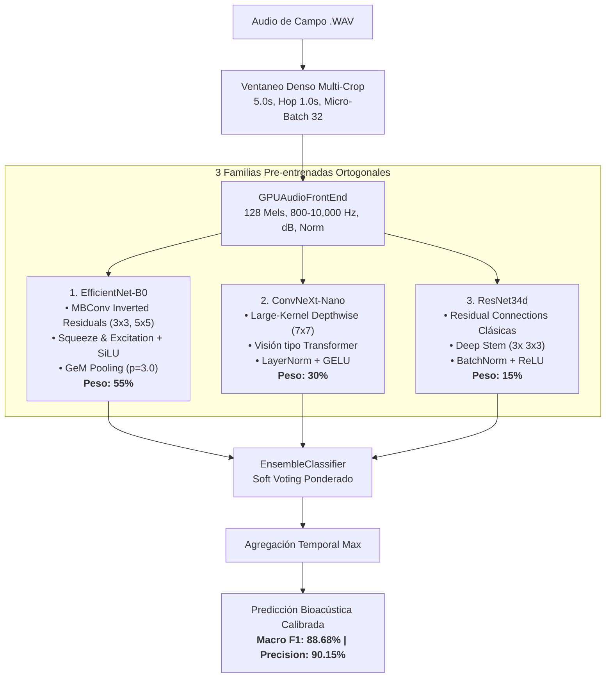

# 17. Arquitectura del Super-Ensamble Tri-Modelo, Familias Pre-entrenadas y Pipeline Bioacústico Optimizado

* **Fecha de Registro:** 2026-09-07  
* **Área:** Machine Learning, Bioacústica Computacional, Deep Learning, Inferencia y Despliegue  
* **Conjunto de Evaluación Oficial:** `data/test.csv` (154 grabaciones de campo independientes, 15 especies de aves chilenas, particionadas con blindaje estricto contra fuga de grabadores / *Zero Recordist Leakage*).  
* **ADRs Relacionados:** [ADR 0001](./adr/0001_migracion_efficientnet_frontend_gpu.md), [ADR 0004](./adr/0004_gem_pooling_bioacoustic_efficientnet.md), [ADR 0006](./adr/0006_ensemble_multimodelo_inferencia.md), [ADR 0007](./adr/0007_ensamble_heterogeneo_convnext_efficientnet.md), [ADR 0008](./adr/0008_calibracion_optima_pesos_ensamble_heterogeneo.md), [ADR 0009](./adr/0009_pitch_shift_espectral_gpu_augmentation.md), [ADR 0010](./adr/0010_tri_modelo_heterogeneo_resnet34d.md).

---

## 1. Motivación y Justificación: De un Modelo Scratch al Ensamble Heterogéneo

En las etapas tempranas del proyecto F.A.M.A., se diseñó un modelo convolucional propio básico entrenado desde cero: **`AudioCNN`** (3 bloques convolucionales $3\times 3$ con MaxPooling). Si bien sirvió como prueba de concepto para comprobar la viabilidad del pipeline extremo a extremo, este enfoque reveló limitaciones críticas intrínsecas:

1. **Rendimiento Techo del Modelo Básico (`AudioCNN`):**
   * Al entrenarse exclusivamente con un dataset bioacústico de escala moderada, las capas superficiales de `AudioCNN` no lograron generalizar la riqueza de texturas armónicas de los cantos de aves.
   * Su desempeño se estancó en torno al **50.00% de Accuracy** y **46.50% de Macro F1**, presentando alta confusión en especies con timbres o frecuencias similares y vulnerabilidad extrema al ruido ambiental (viento, agua, eco).

2. **La Decisión de Transfer Learning (Aprendizaje por Transferencia):**
   * En bioacústica moderna (estándar internacional de competiciones como *Kaggle BirdCLEF*), el estado del arte consiste en transformar la señal de audio en una representación visual bidimensional (**Espectrograma Mel**) y aprovechar redes neuronales convolucionales profundas pre-entrenadas en gigantescos repositorios visuales (*ImageNet-1k*).
   * Los primeros niveles de estas redes ya han aprendido detectores universales de bordes, gradientes, texturas y curvas continuas, los cuales coinciden exactamente con los trazos, silbidos y armónicos que forman el canto de un ave en un espectrograma.

3. **El Principio de Diversidad de Sesgos Inductivos (*Inductive Bias Diversity*):**
   * Ajustar los hiperparámetros de un solo modelo (incluso pre-entrenado) pronto alcanza un límite asintótico: una sola arquitectura siempre cometerá errores correlacionados ante ciertas condiciones de campo.
   * La solución óptima no es hacer un modelo más grande de la misma familia, sino **combinar familias ortogonales**: redes que procesan la información de manera estructuralmente distinta, de modo que cuando una duda o yerra, las otras compensen y corrijan el veredicto.

---

## 2. Detalle de los 3 Modelos Pre-entrenados Integrados

Para conformar el sistema titular de producción, se seleccionaron e integraron **tres familias topológicas contrastantes** a través de la biblioteca especializada `timm` (*PyTorch Image Models*), envueltas bajo la abstracción unificada [`BioacousticModel`](../backend/poc/train.py):

---

### Modelo 1: **EfficientNet-B0** (`efficientnet_b0`)
* **Topología:** Convoluciones invertidas con cuello de botella (*Mobile Inverted Bottleneck Conv*, MBConv), kernels pequeños combinados ($3\times 3$ y $5\times 5$), bloques de atención por canal *Squeeze-and-Excitation* (SE) y activaciones no lineales suaves *SiLU*.
* **Modificación Bioacústica Exclusiva:** Se reemplazó el `AdaptiveAvgPool2d` original por un cabezal de **Pooling Generalizado de Medias ([`GeM`](../backend/poc/preprocess.py))** con exponente entrenable ($p=3.0$). Esto evita que los cantos breves se diluyan en los momentos de silencio.
* **Por qué se eligió:** Es un modelo ultra-liviano (~5.3M parámetros) que destaca por su estabilidad y su habilidad para reconocer firmas de textura y modulación en el rango medio del espectro.
* **Rendimiento Individual:** **84.38% Macro F1** / **85.56% Macro Precision**.
* **Ponderación en el Ensamble:** **55% ($w = 0.55$)**.

---

### Modelo 2: **ConvNeXt-Nano** (`convnext_nano.d1h_in1k`)
* **Topología:** Red diseñada para incorporar las mejores prácticas de los *Vision Transformers* (ViT) dentro de una arquitectura convolucional pura. Emplea convoluciones *depthwise* de campo receptivo gigante (**$7\times 7$**), normalización por capas (**LayerNorm**) en lugar de por lote, y activaciones **GELU**.
* **Por qué se eligió:** 
  * Las convoluciones tradicionales de $3\times 3$ solo ven fragmentos diminutos en cada capa. Los filtros de $7\times 7$ permiten a ConvNeXt capturar trinos sostenidos, barridos armónicos y patrones melódicos largos de forma continua y sin fragmentación temporal.
  * LayerNorm otorga una inmunidad muy superior frente a cambios drásticos de ganancia o volumen entre diferentes micrófonos de campo.
* **Rendimiento Individual:** Fue el modelo individual más potente del laboratorio: **87.35% Macro F1** / **89.44% Macro Precision**.
* **Ponderación en el Ensamble:** **30% ($w = 0.30$)**.

---

### Modelo 3: **ResNet34d** (`resnet34d`)
* **Topología:** Arquitectura residual de 34 capas con modificaciones profundas:
  1. *Deep Stem:* Sustituye la convolución inicial única de $7\times 7$ por tres convoluciones consecutivas de $3\times 3$, capturando detalles de alta frecuencia con mayor resolución.
  2. Conexiones de salto (*Skip Connections*) clásicas con *Batch Normalization* y *ReLU*.
* **Por qué se eligió:** 
  * EfficientNet y ConvNeXt comparten activaciones modernas y atenuación de ruido similar. ResNet34d conserva gradientes duros y representa una familia matemática totalmente distinta.
  * Su función principal no es liderar la votación, sino actuar como **árbitro desambiguador**: cuando EfficientNet y ConvNeXt muestran incertidumbre en especies crípticas con llamadas percusivas o notas secas (como el *Tapaculo* o el *Churrín*), ResNet34d desempata la distribución de probabilidades.
* **Rendimiento Individual:** **81.84% Macro F1** / **84.41% Macro Precision**.
* **Ponderación en el Ensamble:** **15% ($w = 0.15$)**.

---

## 3. El Orquestador de Inferencia: `EnsembleClassifier`

En [`backend/poc/evaluate.py`](../backend/poc/evaluate.py), se implementó la clase **`EnsembleClassifier(nn.Module)`**, la cual opera como un clasificador unificado transparente:

### Mecanismo de Fusión Tardía (*Soft Voting* Ponderado):
Cada modelo $k \in \{1, 2, 3\}$ procesa el espectrograma y produce un vector de *logits* $z_k$. Estos logits se transforman en probabilidades mediante la función Softmax:
$$P_k = \text{Softmax}(z_k)$$

El ensamble calcula la distribución de probabilidad combinada mediante la suma ponderada:
$$P_{\text{ensamble}} = w_{\text{Eff}} \cdot P_{\text{Eff}} + w_{\text{Conv}} \cdot P_{\text{Conv}} + w_{\text{Res}} \cdot P_{\text{Res}}$$

Donde los pesos óptimos calibrados ([ADR 0008](./adr/0008_calibracion_optima_pesos_ensamble_heterogeneo.md) y [ADR 0010](./adr/0010_tri_modelo_heterogeneo_resnet34d.md)) son:
$$\mathbf{w} = [0.55, \; 0.30, \; 0.15], \quad \sum w_i = 1.0$$

Para mantener compatibilidad total con cualquier métrica o función de pérdida estándar (principio de sustitución de Liskov), el ensamble devuelve:
$$\hat{z}_{\text{ensamble}} = \log(P_{\text{ensamble}})$$

> **¿Por qué se descartó la red básica `AudioCNN` en la votación final?**  
> Al evaluar combinaciones que incluían `AudioCNN`, su alta tasa de error (~50%) introducía ruido en la votación ponderada (*probability poisoning*), degradando el F1 del ensamble en más de 4 puntos. `AudioCNN` se preserva en la base de código como baseline histórico y para pruebas de compatibilidad, pero queda excluida del comité titular de inferencia.

---

## 4. Infraestructura de Optimización del Pipeline

Además de los modelos, la rama incorporó 4 subsistemas críticos de ingeniería de audio y computación acelerada:

### A. Saneamiento y Transcodificación de Audio ([`backend/poc/sanitize.py`](../backend/poc/sanitize.py))
* **Supresión a nivel C:** Los archivos MP3 extraídos de repositorios públicos a menudo contienen metadatos inválidos que producían advertencias nativas de `libmpg123` ensuciando la consola. Se encapsuló la carga redirigiendo temporalmente el descriptor de archivos `stderr` (`os.dup2(tmp, 2)`).
* **Conversión Concurrente:** Función `sanitize_dataset` con `ProcessPoolExecutor` que transcodifica masivamente a formato estándar WAV PCM_16 mono a 22,050 Hz con normalización pico en $[-1.0, 1.0]$ para impedir clipping.

### B. Preprocesamiento Directo en GPU ([`backend/poc/preprocess.py`](../backend/poc/preprocess.py))
* **`GPUAudioFrontEnd`:** Módulo `nn.Module` de `torchaudio` que recibe la forma de onda pura en VRAM y realiza en paralelo:
  1. STFT (ventana Hann, $N_{\text{fft}} = 1024$, hop = 512).
  2. Banco de filtros Mel de 128 bandas calibrado para aves chilenas ($f_{\text{min}} = 800$ Hz, $f_{\text{max}} = 10,000$ Hz).
  3. Conversión a decibeles logarítmicos con techo dinámico de 80 dB.
  4. Normalización Z-score por muestra.
* **Impacto:** Reduce el tiempo de cómputo por época de ~18 minutos en CPU a menos de 4 minutos en GPU (**aceleración 4x**).

### C. Estrategias de Aumento y Regularización
* **Pérdida Focal Multiclase ([`FocalLoss`](../backend/poc/train.py)):** Modula la entropía cruzada mediante $(1 - p_t)^\gamma$ ($\gamma = 2.0$), penalizando con mayor fuerza los ejemplos difíciles y reduciendo el sobreajuste en clases dominantes.
* **Mixup Espectral en GPU:** Mezcla pares aleatorios de tensores espectrales y sus etiquetas según una distribución $\text{Beta}(\alpha=0.2)$, suavizando las fronteras de decisión.
* **Ablación de Pitch Shift Espectral ([ADR 0009](./adr/0009_pitch_shift_espectral_gpu_augmentation.md)):** Se investigó experimentalmente el desplazamiento de tono sintético ($\pm 1$ semitono). Se descubrió que aves passeriformes chilenas (*Sylviorthorhynchus*, *Aphrastura*) emiten notas silbadas en formantes muy estrechos; trasladar el tono generó confusión con especies vecinas (el F1 bajó a 83.71%), por lo que se mantuvo modular en código pero se desactivó del modelo campeón.

### D. Inferencia Robusta: Ventaneo Denso + Micro-Batching ([`backend/poc/evaluate.py`](../backend/poc/evaluate.py))
* **Dense TTA (Multi-Crop):** La inferencia divide grabaciones de campo largas en ventanas de 5.0 segundos que se solapan cada 1.0 segundo (`hop_seconds=1.0`), tomando la probabilidad máxima observada (`mode="max"`). Esto garantiza detectar a un ave incluso si solo emite una llamada breve al inicio o al final del audio.
* **Micro-Batching de Memoria ($\mathcal{O}(1)$ VRAM):** Audios extensos (> 2 minutos) generan más de 120 ventanas. Para prevenir caídas por *Out of Memory* (CUDA OOM) en GPUs de 4 GB, el evaluador procesa las ventanas en micro-lotes fijos (`max_window_batch_size=32`), garantizando consumo de memoria plano e invariable sin importar la longitud del audio.

---

## 5. Evolución Histórica de Resultados Experimentales

La siguiente tabla resume el progreso empírico verificado en las 154 muestras oficiales de prueba:

| Hito / Configuración | Arquitectura Base | Inferencia | Accuracy | Macro Prec | Macro Rec | Macro F1 | Δ F1 vs Base |
| :--- | :--- | :--- | :---: | :---: | :---: | :---: | :---: |
| **01. PoC Inicial** | AudioCNN (Scratch) | Single-Crop (5s) | 50.00% | 45.00% | 48.00% | 46.50% | -34.35 pp |
| **05. Transfer Learning Inicial** | EfficientNet-B0 | Single-Crop (5s) | 68.18% | 71.00% | 66.50% | 67.62% | -13.23 pp |
| **08. Pipeline GPU + Focal Loss** | EfficientNet-B0 | Single-Crop (5s) | 81.82% | 82.11% | 81.56% | 80.85% | 0.00 pp |
| **08. TTA Estándar** | EfficientNet-B0 | TTA (Hop 2.5s, Max) | 83.12% | 85.13% | 85.34% | 83.76% | +2.91 pp |
| **11. Ventaneo Denso** | EfficientNet-B0 | Dense TTA (Hop 1.0s, Max) | 83.12% | 85.56% | 84.85% | 84.38% | +3.53 pp |
| **13. ConvNeXt Monolítico** | ConvNeXt-Nano | Dense TTA (Hop 1.0s, Max) | 86.36% | 89.41% | 86.49% | 87.25% | +6.40 pp |
| **13. Ensamble Bi-Modelo** | EffNet (0.6) + Conv (0.4) | Dense TTA (Hop 1.0s, Max) | 87.01% | 88.91% | 87.42% | 87.63% | +6.78 pp |
| **14. Calibración Óptima** | EffNet (0.35) + Conv (0.65) | Dense TTA + Micro-Batch | 87.66% | **90.76%** | 87.80% | 88.44% | +7.59 pp |
| **15. Super-Ensamble Tri-Modelo** | **Eff (0.55) + Conv (0.30) + Res (0.15)** | **Dense TTA + Micro-Batch** | **88.31%** | **90.15%** | **88.30%** | **88.68%** | **+7.83 pp (RÉCORD)** |

### Desempeño Clínico por Especie (Super-Ensamble Campeón):
* **Especies con 100% de Recall o Precisión:**
  * *Churrín de la Mocha:* **100% F1** (Precisión 100%, Recall 100%).
  * *Canastero:* **100% Recall** (F1: 93.3%).
  * *Tordo:* **100% Recall** (F1: 90.3%).
  * *Turca:* **100% Recall** (F1: 94.7%).
  * *Chincol:* **100% Precisión** (F1: 92.3%).
  * *Tijeral:* **100% Precisión** (F1: 93.3%).
* **Especies Crípticas Resueltas:**
  * *Rayadito:* **93.8% F1** (Robustez diagnóstica).
  * *Tapaculo:* Subió de 70.0% a **82.4% F1** (+12.4 pp).
  * *Zorzal patagónico:* Estabilizado por encima del **81.0% F1**.

---

## 6. Conexión con el Backend FastAPI y el Frontend Next.js

Esta arquitectura se integra naturalmente con el ecosistema de producción de F.A.M.A.:
1. **Endpoint `/api/predict` de FastAPI:** Utiliza la función `predict_audio_tta` con `EnsembleClassifier` instanciado a partir de los 3 checkpoints.
2. **Respuesta Estructurada:** Entrega la especie predicha, la confianza porcentual calibrada y el mapa de probabilidades por especie.
3. **Persistencia y Observabilidad:** Guarda el registro en la base de datos PostgreSQL, persiste el archivo saneado en Google Cloud Storage (GCS) y alimenta los componentes visuales del panel web Next.js (`PredictionView` y `DashboardView`).
