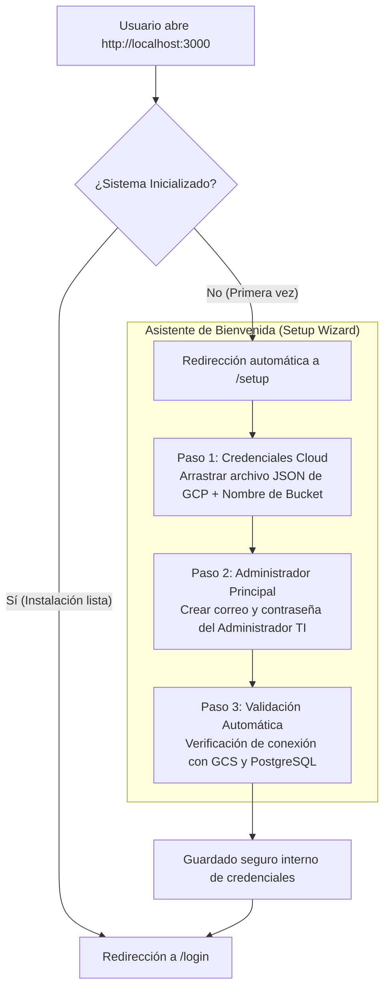

# 20. Modelo de Producto, Estrategia de Despliegue, Concurrencia y Arquitectura Operativa de F.A.M.A.

* **Fecha de Registro:** Septiembre 2026  
* **Área:** Ingeniería de Software, Arquitectura de Sistemas, MLOps On-Premise / Híbrido, Estrategia de Producto y Despliegue  
* **Proyecto:** Framework MLOps Híbrido para Clasificación Bioacústica (F.A.M.A.)  
* **Documentos Base de Referencia:**  
  * Tesis de Grado: [`docs/VIDA_01_CINF_FINAL_PT_2026_1_CARTES.md`](./VIDA_01_CINF_FINAL_PT_2026_1_CARTES.md)  
  * Análisis de Objetivos: [`docs/analisis_objetivos_fama.md`](./analisis_objetivos_fama.md)  
  * Arquitectura del Super-Ensamble: [`docs/17_arquitectura_super_ensamble_y_modelos_preentrenados.md`](./17_arquitectura_super_ensamble_y_modelos_preentrenados.md)  

---

## 1. Visión General: ¿Qué es F.A.M.A. como Producto?

**F.A.M.A.** no es una aplicación web SaaS genérica alojada al 100% en la nube pública (como Netflix o Spotify), ni tampoco es un conjunto disperso de scripts manuales de Python que solo funcionan en la máquina del desarrollador.

Como producto de software, se define como una plataforma **Self-Hosted (Auto-alojada) de Arquitectura Híbrida**, diseñada específicamente para **instituciones académicas, laboratorios científicos y centros de investigación**.

### El Dilema que Resuelve el Producto
1. **Soluciones 100% Cloud (AWS SageMaker, Google Vertex AI):**  
   Cobran cientos de dólares por hora de GPU remota, resultando financieramente inviables para los presupuestos estándar de departamentos universitarios o tesistas.
2. **Soluciones 100% Locales (Scripts en laptops):**  
   Saturan el hardware personal, provocan desbordamientos de memoria (`CUDA OOM`), no tienen base de datos, carecen de respaldo y no permiten compartir datasets entre investigadores.
3. **El Punto de Equilibrio F.A.M.A.:**  
   La **nube (Google Cloud Platform)** se usa únicamente como almacén estático y base de datos (costo marginal de centavos de dólar al mes), mientras que el **cómputo pesado (PyTorch con aceleración GPU)** se ejecuta de forma gratuita en el hardware local de la institución. La interfaz web democratiza el acceso para que cualquier usuario interactúe sin saber de terminales ni de infraestructura.

```text
┌────────────────────────────────────────────────────────────────────────┐
│                        CLIENTES WEB LIGEROS                            │
│           (Cualquier dispositivo con navegador y conexión)             │
│                                                                        │
│    [📱 Smartphone en Terreno]   [💻 Laptop Escolar]   [🖥️ PC Oficina]  │
└───────────────────────────────────┬────────────────────────────────────┘
                                    │ Peticiones HTTPS (JSON / Audio)
                                    ▼
┌────────────────────────────────────────────────────────────────────────┐
│             ESTACIÓN / SERVIDOR LOCAL DE CÓMPUTO ON-PREMISE            │
│            (Computador con GPU dedicado en el Laboratorio)             │
│                                                                        │
│   • Backend FastAPI (Orquestador Asíncrono)                            │
│   • PyTorch 2.5 + CUDA (Super-Ensamble Tri-Modelo en VRAM)             │
│   • Frontend Next.js (Servido en puerto web)                           │
│   • Cola de Procesos (Job Queue FIFO para entrenamientos)              │
└───────────────────┬────────────────────────────────┬───────────────────┘
                    │                                │
                    ▼                                ▼
       ☁️ Google Cloud Storage            🗄️ PostgreSQL (Cloud SQL)
       (Datasets masivos y binarios)      (Métricas, usuarios y feedback)
```

---

## 2. Topología de Red y Ámbito de Acceso: ¿Es un Sistema Público o de Recinto?

F.A.M.A. se adapta a la política de infraestructura de cada institución, soportando dos modalidades operativas:

### Modalidad A: Red Interna de Laboratorio / Campus (Intranet)
* **Dónde corre:** En un computador de escritorio con tarjeta gráfica NVIDIA (o servidor en rack) ubicado físicamente en las dependencias de la universidad (ej. Laboratorio de Sistemas de Información, UBB).
* **Cómo acceden los usuarios:**  
  Cualquier estudiante, docente o tesista conectado a la red Wi-Fi universitaria (o mediante VPN institucional) abre su navegador e ingresa a una dirección local interna:
  * `http://fama.ciencias.ubiobio.cl` o bien `http://192.168.1.100:3000`.
* **Ventaja:** Máxima seguridad y latencia cero para transferencia masiva dentro de la red local.

### Modalidad B: Acceso Público en Internet (Con Dominio Institucional)
* **Configuración:** La universidad asigna una IP pública fija con certificado SSL o configura un túnel seguro (e.g., Cloudflare Tunnel / Nginx Proxy) hacia el puerto del frontend de la máquina local.
* **Cómo acceden los usuarios:**  
  Cualquier persona autorizada puede ingresar desde cualquier parte del mundo ingresando a la URL pública (ej. `https://fama.ubiobio.cl`).
* **Uso en Terreno:** Un biólogo recolectando audios en un parque nacional o zona rural puede abrir la web desde su teléfono móvil y clasificar muestras acústicas en vivo mientras el servidor de la universidad realiza la inferencia en milisegundos.

---

## 3. Estrategia de Distribución y Empaquetado: ¿Cómo se Entrega el Software?

Uno de los mayores riesgos de usabilidad en proyectos de Machine Learning es la "fricción de instalación". Si se le entrega al cliente una carpeta con código fuente exigiéndole instalar manualmente Python, CUDA Toolkit, Node.js y dependencias del sistema operativo, el software fracasa operativamente.

Para garantizar una experiencia de nivel profesional, F.A.M.A. adopta el estándar de la industria: **Contenedores Docker (`docker-compose`)**.

### ¿Qué generamos nosotros como equipo desarrollador?
1. **`backend/Dockerfile`**: Empaqueta la imagen de Linux con Python 3.12, librerías bioacústicas (Librosa, soundfile), PyTorch y soporte para controladores CUDA NVIDIA.
2. **`frontend/Dockerfile`**: Empaqueta la imagen optimizada de producción de Next.js.
3. **Imágenes Publicadas en Registro Seguro:** Las imágenes compiladas se suben a un registro de contenedores (Docker Hub institucional o GitHub Container Registry: `ghcr.io/fabiancartes/fama:latest`).

### ¿Qué se le entrega al cliente (Profesor o Encargado de TI)?
Al cliente **NO se le entregan miles de archivos de código ni repositorios desarmados**. Únicamente se le entrega:
* Un único archivo: **`docker-compose.yml`**
* Un script de ejecución rápida de dos líneas: **`iniciar_fama.bat`** (Windows) o **`iniciar_fama.sh`** (Linux).

### ¿Qué debe hacer el cliente para encender el sistema?
1. Instalar **Docker Desktop** en la máquina que posea la GPU (instalador estándar de Windows con soporte WSL2 y CUDA).
2. Guardar el archivo `docker-compose.yml` en una carpeta local (ej: `C:\FAMA\`).
3. Hacer doble clic en `iniciar_fama.bat` (o ejecutar en terminal `docker compose up -d`).
4. Docker descarga automáticamente los contenedores sellados, los vincula a la tarjeta gráfica y arranca PostgreSQL, FastAPI y Next.js.
5. El usuario abre su navegador en `http://localhost:3000`. El sistema está 100% operativo sin haber configurado variables de sistema ni dependencias de software.

---

## 4. Experiencia de Primer Inicio sin Fricción: El Asistente de Configuración (Setup Wizard)

Para eliminar por completo la necesidad de que el usuario final edite archivos de texto ocultos (`.env`) o manipule claves en código:

### Flujo del Primer Inicio
Cuando el navegador accede a la aplicación por primera vez, el frontend consulta al backend el estado de inicialización del sistema:



1. **Paso 1 (Almacenamiento Cloud):**  
   Una interfaz gráfica limpia solicita: *"Para conectar el almacenamiento masivo, arrastra aquí tu archivo de credenciales de Google Cloud (`.json`) y escribe el nombre de tu bucket"*. Al soltar el archivo, el backend lo almacena en un directorio seguro y privado del contenedor.
2. **Paso 2 (Cuenta de Administrador Principal):**  
   Solicita el correo y contraseña de la persona responsable del nodo (el técnico del laboratorio o el profesor a cargo).
3. **Paso 3 (Finalización):**  
   El sistema escribe su configuración interna, inicializa las tablas maestras de PostgreSQL y redirige a la pantalla estándar de inicio de sesión (`/login`).

---

## 5. Gestión de Cuentas y Credenciales de Google Cloud Storage (GCS)

Una duda recurrente en este modelo de negocio es: *¿Cada alumno o investigador debe crearse una cuenta en Google Cloud?*

> **Principio de Aislamiento:** **NO.** Los usuarios finales (estudiantes, tesistas o docentes) **NUNCA** deben crearse una cuenta de Google Cloud, ni ingresar tarjetas de crédito, ni gestionar APIs.

### ¿Cómo opera en la realidad?
* La institución (la Universidad del Bío-Bío o el laboratorio) posee **una única cuenta institucional en Google Cloud Platform**.
* En esa cuenta se crea un proyecto (ej: `fama-bioacustica-ubb`) y se genera **una sola Cuenta de Servicio (Service Account IAM)** con permisos estrictos de lectura y escritura sobre el bucket de almacenamiento.
* Esta credencial es cargada una sola vez en el Asistente de Configuración Inicial (Paso 4).
* A partir de ese momento, **el backend de F.A.M.A. actúa como intermediario seguro**: cuando un alumno sube un audio desde su celular, la web se comunica con FastAPI, y FastAPI usa la cuenta institucional para depositar el audio en GCS. Para el alumno, la nube es completamente transparente.
* **Costo Económico:** Como se calculó en el Capítulo 4 de la tesis, el almacenamiento en GCS tiene un costo marginal de ~$4.500 CLP mensuales por decenas de gigabytes de audio, costo mínimo que absorbe el laboratorio mientras se ahorra millones de pesos en no pagar GPUs de nube.

### ¿Y si otra universidad instala F.A.M.A.?
Esa otra universidad simply completa el Asistente Inicial con su propio archivo `.json` de Google Cloud y su propio bucket, operando como una instancia privada, soberana e independiente.

---

## 6. Concurrencia y Comportamiento Multiusuario

¿Qué ocurre cuando múltiples usuarios interactúan simultáneamente con la plataforma? El sistema maneja cada caso según la naturaleza de la carga:

### Caso A: Múltiples Injerencias Bioacústicas en Vivo (Predicción)
* **Comportamiento:** **Alta concurrencia y fluidez.**
* **Razón técnica:** Una inferencia acústica con el Super-Ensamble Tri-Modelo en modo `torch.no_grad()` toma entre **0.5 y 0.8 segundos**. FastAPI es un servidor asíncrono sobre `uvloop` capaz de enrutar decenas de peticiones concurrentes. La memoria de video (VRAM) aloja los pesos de los modelos de forma residente; evaluar un espectrograma adicional solo requiere una pasada hacia adelante (*forward pass*), permitiendo que varios usuarios reciban sus clasificaciones en tiempo real casi al instante.

### Caso B: Múltiples Subidas o Descargas de Datasets (Ingesta)
* **Comportamiento:** **Completamente paralelo sin bloqueos.**
* **Razón técnica:** Google Cloud Storage está estructurado sobre una red global distribuida de alta disponibilidad. Cada subida o descarga de archivos viaja por canales independientes hacia los servidores de Google; el servidor local solo actualiza los metadatos en PostgreSQL.

### Caso C: Múltiples Solicitudes de Entrenamiento (El Cuello de Botella Físico)
* **Riesgo:** A diferencia de la inferencia, el entrenamiento de redes neuronales profundas (EfficientNet-B0, ConvNeXt-Nano, ResNet-34d) demanda el **100% de la capacidad de cómputo de la GPU y gigabytes continuos de VRAM** para calcular gradientes y retropropagación (*backpropagation*). Si dos entrenamientos corrieran a la vez en la misma GPU física, el sistema colapsaría con un error fatal de memoria (`CUDA Out of Memory`).
* **Solución de F.A.M.A.: Cola de Trabajos Secuencial (Job Queue FIFO):**  
  F.A.M.A. implementa un control de estado en el backend:
  1. Si el *Usuario A* inicia un entrenamiento, el sistema pasa a estado `entrenando` y bloquea la GPU para esa tarea.
  2. Si el *Usuario B* intenta iniciar otro entrenamiento simultáneamente, la interfaz no rompe el sistema ni arroja un error técnico; en su lugar, despliega un aviso claro:
     > *"Existe un entrenamiento en curso ejecutado por el usuario A (Época actual: 14/35). Su solicitud ha sido agregada a la cola de procesamiento en la posición #1 y comenzará automáticamente cuando el hardware se libere."*
  3. Esto garantiza que la máquina del laboratorio nunca se caiga y procese los lotes de forma disciplinada.

---

## 7. Modelo de Roles y Seguridad (Tabla 6.2 de la Tesis)

Para proteger la integridad del sistema sin complicar a los usuarios, se definen dos roles estrictos basados en el modelo relacional de la base de datos:

| Rol | ¿Quién es? | Permisos y Alcance |
|:---|:---|:---|
| **Administrador** | Encargado de TI, Director del Laboratorio o Profesor a cargo. | • Acceso total al sistema y panel de configuración.<br/>• Crear, editar o dar de baja cuentas de Investigadores.<br/>• Configurar y auditar la conexión con Google Cloud.<br/>• Supervisar la telemetría del nodo de cómputo (CPU, VRAM, RAM, Carga).<br/>• Interrumpir forzosamente procesos atascados (*Kill Process*). |
| **Investigador** | Docentes, Investigadores de campo, Ayudantes, Tesistas y Alumnos. | • Visualizar el Dashboard general MLOps.<br/>• Sincronizar y cargar lotes de audio en el módulo de Ingesta.<br/>• Configurar hiperparámetros y solicitar entrenamientos locales.<br/>• Subir audios de prueba en Predicción y ver el oscilograma interactivo.<br/>• **Retroalimentar predicciones erróneas mediante telemetría activa.** |

---

## 8. El Ciclo de Retroalimentación Activa y Telemetría de Errores (RF_06 / CU_INV_07)

Este componente es el corazón del concepto de **MLOps continuo** en la tesis de F.A.M.A.:

1. **Inferencia en Predicción:**  
   Un investigador sube un audio grabado en campo. El Tri-Modelo predice, por ejemplo:  
   *`"Clasificación: Turca (Confianza: 68.4%)"`*.
2. **Juicio Experto del Investigador:**  
   El ornitólogo o biólogo escucha el audio en el reproductor integrado y sabe que en realidad se trata de un *`Chucao`* (una especie que suele solaparse acústicamente con la Turca).
3. **Mecanismo de Telemetría Activa (En Pantalla):**  
   Bajo el resultado aparecen dos botones interactivos:
   * **[Confirmar Acierto]** (Verde)
   * **[Corregir Clasificación]** (Naranja/Rojo)
4. **Captura y Cierre del Ciclo:**  
   Al presionar "Corregir Clasificación", se abre un menú desplegable con el catálogo de especies. El usuario selecciona *Chucao* y presiona confirmar.
5. **Persistencia Dual Automatizada:**  
   * En **PostgreSQL (Tabla `retroalimentacion`)**, se inserta un registro:  
     `id_prediccion = X`, `fue_correcta = False`, `etiqueta_corregida = 'Chucao'`.
   * En **Google Cloud Storage**, el backend copia de inmediato el archivo de audio dentro de una carpeta especial de retroalimentación (`gs://mi-bucket/feedback/chucao/...`).
   * **Resultado:** El dataset crece con datos curados por humanos en terreno, listos para que en el siguiente re-entrenamiento el modelo aprenda a corregir su error histórico.

---

## 9. Hoja de Ruta (Roadmap) hacia el 100% del Proyecto y Tesis

Con todo lo discutido y aclarado, este es el plan de acción concreto para cerrar el desarrollo del proyecto en su totalidad:

```text
┌────────────────────────────────────────────────────────────────────────┐
│ PASO 1: TELEMETRÍA DE ERRORES Y RETROALIMENTACIÓN ACTIVA (RF_06)       │
│ • Crear modelo y tabla SQLAlchemy `retroalimentacion` en backend.     │
│ • Endpoint POST `/api/prediction/feedback` para registrar corrección.  │
│ • Panel interactivo en `PredictionView.tsx` (Confirmar / Corregir).    │
│ • Sincronización del audio corregido hacia GCS.                        │
└───────────────────────────────────┬────────────────────────────────────┘
                                    │
                                    ▼
┌────────────────────────────────────────────────────────────────────────┐
│ PASO 2: MÓDULO DE USUARIOS Y AUTENTICACIÓN (CU_SES_01 / CU_ADM_01)     │
│ • Modelo SQLAlchemy `usuario` (rol: Administrador / Investigador).     │
│ • Endpoints de Login con JWT (`/api/auth/login`) y registro.           │
│ • Vista de Login en frontend y protección de navegación por roles.     │
└───────────────────────────────────┬────────────────────────────────────┘
                                    │
                                    ▼
┌────────────────────────────────────────────────────────────────────────┐
│ PASO 3: ASISTENTE DE CONFIGURACIÓN INICIAL (SETUP WIZARD)              │
│ • Detección en frontend si el sistema es nuevo (`setup_completed`).    │
│ • Asistente visual en Next.js para cargar el JSON de GCP y crear Admin.│
│ • Endpoint para guardar credenciales sin editar `.env` a mano.         │
└───────────────────────────────────┬────────────────────────────────────┘
                                    │
                                    ▼
┌────────────────────────────────────────────────────────────────────────┐
│ PASO 4: EMPAQUETADO DOCKER PARA DISTRIBUCIÓN (PRODUCTO FINAL)          │
│ • `Dockerfile` para backend FastAPI (con PyTorch + CUDA).              │
│ • `Dockerfile` para frontend Next.js.                                  │
│ • `docker-compose.yml` maestro para despliegue en un clic.             │
└────────────────────────────────────────────────────────────────────────┘
```

---

## 💡 Conclusión para la Defensa de Título

Ante cualquier pregunta de la comisión evaluadora sobre la viabilidad comercial o la operatividad del proyecto en el mundo real, la postura técnica oficial es:

> *"F.A.M.A. fue concebido bajo el paradigma de Software On-Premise con Orquestación Cloud. Abstrae la complejidad de la infraestructura dividiendo las responsabilidades: el cómputo pesado reside en el hardware del laboratorio para eliminar los costos prohibitivos de GPU en la nube, los datos se centralizan económicamente en Google Cloud Storage mediante una cuenta de servicio institucional única, y los usuarios finales consumen el sistema como una aplicación web ligera desde cualquier dispositivo. La distribución del sistema está empaquetada mediante contenedores Docker con aceleración de hardware y un asistente de primer inicio, lo que elimina cualquier barrera técnica para su adopción definitiva en la Universidad."*
