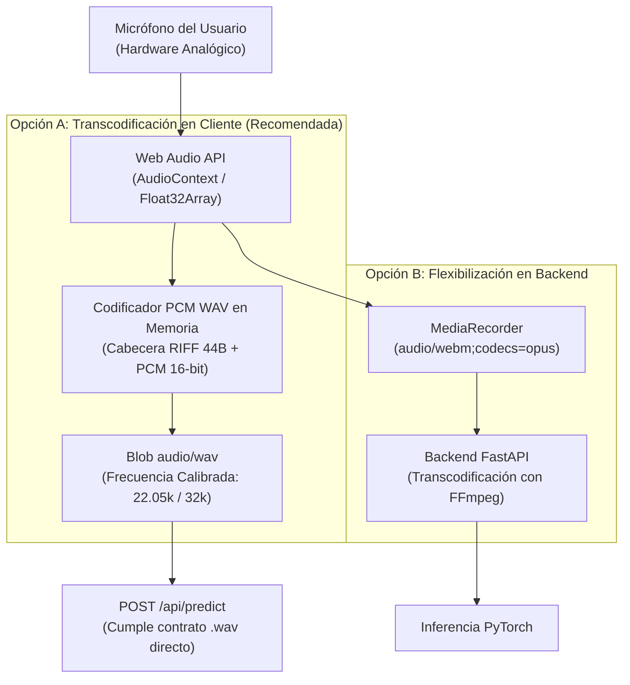

# Problema Conocido 05: Restricción Estricta de Formato PCM .WAV y Pipeline de Captura por Micrófono Web

**Proyecto:** Framework MLOps Híbrido para Clasificación de Audio (F.A.M.A.)  
**Fecha:** Septiembre 2026  
**Área:** Inferencia Acústica, UI/UX Frontend, Pipeline Digital de Señales (DSP)  
**Estado:** Caracterizado, Análisis de Impacto Acústico y Alternativas Evaluadas  

---

## 1. Contexto y Problema Detectado

En el subsistema de inferencia acústica ([`PredictionView.tsx`](file:///home/kevin/Work/fama/frontend/components/views/PredictionView.tsx)), el sistema permite actualmente subir grabaciones de audio mediante un selector de archivos (`<input type="file" accept=".wav,audio/wav">`). Al evaluar la habilitación de captura directa en vivo a través del micrófono del usuario en el navegador web, surge una incompatibilidad arquitectural fundamental entre las restricciones del backend y los estándares de audio web.

### 1.1 Restricción Estricta en el Backend (FastAPI)
En [`backend/app/main.py`](file:///home/kevin/Work/fama/backend/app/main.py#L506), el endpoint de inferencia impone un control estricto de extensión y formato de contenedor:

```python
# backend/app/main.py
if not filename.lower().endswith(".wav"):
    raise HTTPException(
        status_code=status.HTTP_400_BAD_REQUEST,
        detail="Formato no válido. Solo se permiten archivos de audio con extensión .wav",
    )
```

Cualquier archivo con otra extensión o contenedor es rechazado inmediatamente con error `HTTP 400 Bad Request`.

### 1.2 Comportamiento Nativo de los Navegadores Web
La API nativa estándar de captura de audio en navegadores web (`MediaRecorder`) **no genera archivos PCM .wav nativamente**. Debido a consideraciones de ancho de banda y compresión:
* **Google Chrome / Chromium / Edge / Opera / Firefox**: Capturan audio en contenedores comprimidos `audio/webm;codecs=opus` u `audio/ogg;codecs=opus`.
* **Apple Safari (WebKit)**: Captura en contenedores `audio/mp4` (AAC).

Si el frontend captura audio mediante `MediaRecorder` estándar y simplemente le asigna un nombre ficticio terminado en `.wav` (e.g. `grabacion.wav`) sin transcodificación real, el backend fallará al procesar la cabecera binaria con `soundfile` / `torchaudio`, ya que la estructura interna no corresponde a modulación por código de pulsos lineal (Linear PCM RIFF/WAV).

---

## 2. Impacto Físico y Acústico en los Modelos de Machine Learning

La exigencia de formato `.wav` en F.A.M.A. no es un capricho de implementación, sino una necesidad física de la cadena de procesamiento bioacústico y mecánico:

1. **Degradación Espectral de Códecs con Pérdida (Lossy Compression)**:
   Los códecs como Opus o AAC aplican algoritmos psicoacústicos diseñados para voz humana, aplicando filtros pasa-altos agresivos y eliminando componentes de alta frecuencia o transientes de baja potencia.
2. **Distorsión en Separación HPSS (Armónico-Percusivo)**:
   El Super-Ensamble de motores ([`EngineEnsemblePredictor`](file:///home/kevin/Work/fama/backend/app/services/predictors/engine_ensemble_predictor.py)) utiliza un frontend HPSS de 3 canales a 32 kHz. Los artefactos de cuantización temporal de Opus alteran las matrices de fase del STFT, degradando la separación armónica de rodamientos y correas.
3. **Fidelidad del Banco de Filtros Mel en GPU**:
   [`GPUAudioFrontEnd`](file:///home/kevin/Work/fama/backend/poc/preprocess.py) asume tensores crudos con amplitud lineal para calcular densidades espectrales normalizadas (dB) con `f_min` y `f_max` calibrados. El contenedor PCM WAV de 16 bits sin compresión preserva la integridad física de la señal acústica original.

---

## 3. Alternativas Técnicas de Solución



### Opción A: Codificación PCM WAV en el Cliente vía Web Audio API (Recomendada)
* **Mecanismo:** En lugar de utilizar `MediaRecorder`, el frontend captura el stream de micrófono con `AudioContext` de la **Web Audio API**. Se obtienen las muestras de audio en punto flotante (`Float32Array`), se re-muestrean si es necesario y se serializan en un ArrayBuffer escribiendo la cabecera canónica **RIFF/WAV de 44 bytes**:
  - `ChunkID`: `"RIFF"`
  - `Format`: `"WAVE"`
  - `AudioFormat`: `1` (Linear PCM)
  - `BitsPerSample`: `16`
  - `SampleRate`: `22050` o `32000` Hz
* **Ventajas:**
  - El backend mantiene su contrato estricto sin modificaciones de infraestructura.
  - Cero consumo de cómputo en el servidor FastAPI para transcodificación.
  - Cero dependencias externas de librerías en el cliente (implementación nativa en ~60 líneas de TypeScript).
  - Audio sin compresión lossy directo a la VRAM de la GPU.
* **Desventajas:**
  - El tamaño de carga por red es ligeramente mayor que un archivo WebM comprimido (aprox. 150 KB para 2 segundos a 32 kHz).

### Opción B: Flexibilización del Endpoint en Backend con FFmpeg / Pydub
* **Mecanismo:** Modificar el endpoint `POST /api/predict` para aceptar MIME types `audio/webm`, `audio/ogg`, `audio/mp4` además de `.wav`, invocando `torchaudio.load()` con backend `sox` o `ffmpeg` en el servidor para convertirlo a tensor antes de la inferencia.
* **Ventajas:**
  - El código de grabación en el frontend es el estándar básico de `MediaRecorder`.
* **Desventajas:**
  - Requiere instalar binarios del sistema `ffmpeg` en el entorno de producción y contenedor Docker.
  - Mayor latencia por petición (I/O temporal y decodificación de códecs lossy en CPU del servidor).
  - Pérdida irrecuperable de resolución espectral introducida previamente por el navegador.

---

## 4. Decisión Técnica y Hoja de Ruta

Se adopta formalmente la **Opción A (Transcodificación PCM WAV en el Cliente)** como la solución arquitectónicamente superior:

1. **Desacoplamiento MLOps**: Mantiene la API de predicción rápida, determinista y orientada exclusivamente a tensores acústicos de alta fidelidad.
2. **Implementación en Frontend**: Cuando se incorpore la funcionalidad de grabación por micrófono en [`PredictionView.tsx`](file:///home/kevin/Work/fama/frontend/components/views/PredictionView.tsx), se integrará una utilidad de serialización WAV (`frontend/lib/audio/wavEncoder.ts`) que transforme el stream del micrófono directamente a un `Blob` de tipo `audio/wav` con nombre canónico `microfono_captura.wav`.
