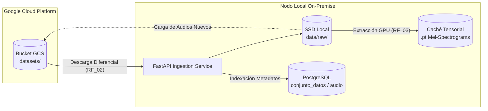
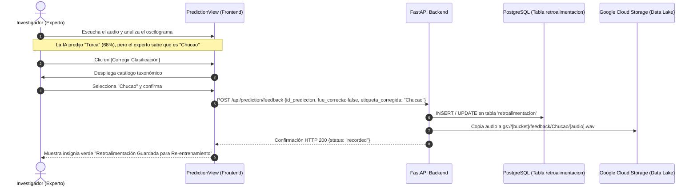

# Manual de Usuario y Operación de la Plataforma F.A.M.A.
### Guía Integral para Investigadores y Administradores de Sistema
**Framework MLOps Híbrido para Clasificación Bioacústica y Diagnóstico Industrial de Señales**  
*Documentación Técnica Correspondiente a la Actividad 12 de la Tesis de Grado (Ingeniería Civil en Informática, Universidad del Bío-Bío)*

---

## 1. Introducción y Propósito del Sistema

El framework **F.A.M.A.** (*Flujo de Clasificación de Audio y Machine-learning Avanzado*) es una plataforma de software de arquitectura híbrida diseñada específicamente para resolver las limitaciones operativas y financieras que enfrentan los centros de investigación, laboratorios científicos y departamentos académicos al trabajar con Inteligencia Artificial aplicada a señales acústicas.

Tradicionalmente, los investigadores se ven forzados a elegir entre dos extremos ineficientes:
1. **Soluciones 100% Cloud (Cloud-Native):** Plataformas como Google Vertex AI o AWS SageMaker cobran tarifas prohibitivas por hora de GPU remota, resultando financieramente inviables para los presupuestos universitarios.
2. **Soluciones 100% Locales (Scripts Aislados):** La ejecución manual de código en laptops personales satura el hardware, genera errores fatales de memoria (`CUDA OOM`), carece de base de datos relacional para trazabilidad de experimentos y dispersa los datos sin respaldos centralizados.

**F.A.M.A. materializa el punto de equilibrio:** delega la persistencia masiva de audios en la nube de bajo costo (**Google Cloud Storage**) y la trazabilidad de experimentos en una base de datos relacional (**PostgreSQL**), mientras que la orquestación y el cómputo pesado de Deep Learning (**PyTorch con aceleración GPU NVIDIA**) se ejecutan de manera gratuita en la infraestructura física de la institución. A través de una interfaz web moderna e intuitiva desarrollada en **Next.js**, la plataforma democratiza el acceso para que cualquier científico pueda gestionar datos, entrenar modelos de vanguardia y clasificar audio en tiempo real sin requerir conocimientos avanzados de infraestructura cloud o terminales de comandos.

```text
┌────────────────────────────────────────────────────────────────────────────────────────┐
│                                 TOPOLOGÍA HÍBRIDA F.A.M.A.                             │
└────────────────────────────────────────────────────────────────────────────────────────┘
                                    │
                                    ▼
       ┌──────────────────────────────────────────────────────────────┐
       │                 CLIENTES WEB LIGEROS                         │
       │    (Navegadores en Laptops, PCs de Laboratorio y Móviles)     │
       └────────────────────────────┬─────────────────────────────────┘
                                    │ HTTP / WebSocket (Puerto 3000 / 8000)
                                    ▼
       ┌──────────────────────────────────────────────────────────────┐
       │        NODO DE CÓMPUTO ON-PREMISE (ESTACIÓN DE TRABAJO)      │
       │                                                              │
       │  • Frontend Next.js: Interfaz de Usuario React / Tailwind    │
       │  • Backend FastAPI: Orquestador Asíncrono de Pipelines      │
       │  • ML Core PyTorch 2.5: Super-Ensambles Heterogéneos en GPU  │
       │  • ModelRegistry: Catálogo de Modelos y Estrategias Dinámicas│
       │  • Cache Tensorial Mel: Aceleración de E/S en SSD local      │
       └───────────────────┬──────────────────────┬───────────────────┘
                           │                      │
       Conexión IAM / JSON │                      │ Transacciones ACID
                           ▼                      ▼
       ┌──────────────────────────────┐  ┌──────────────────────────────┐
       │  Google Cloud Storage (GCS)  │  │   PostgreSQL (Cloud SQL / DB)│
       │   • Datasets crudos y audio  │  │   • Métricas de entrenamiento│
       │   • Repositorio de feedback  │  │   • Historial de inferencias │
       │   • Costo marginal mensual   │  │   • Auditoría y usuarios     │
       └──────────────────────────────┘  └──────────────────────────────┘
```

---

## 2. Modelo de Roles, Permisos y Autenticación

El sistema implementa un esquema de Control de Acceso Basado en Roles (**RBAC**) que salvaguarda la integridad de los recursos computacionales y del almacenamiento en la nube sin entorpecer el trabajo analítico cotidiano.

### 2.1. Matriz de Roles y Responsabilidades

| Funcionalidad / Módulo | Rol: Investigador | Rol: Administrador de TI / Nodo |
| :--- | :---: | :---: |
| **Inicio de Sesión y Gestión de Perfil** (`CU_SES_01`, `CU_SES_02`) | Lectura / Modificación propia | Control total de cuentas |
| **Visualización del Dashboard MLOps** (`CU_INV_04`) | Lectura de KPIs y telemetría | Lectura y diagnóstico avanzado |
| **Auditoría de Salud de Microservicios** (`CU_ADM_04`) | Estado simplificado | Diagnóstico de latencia y puertos |
| **Monitoreo de Hardware (GPU/CPU/RAM)** (`CU_ADM_02`) | Lectura informativa | Supervisión térmica y de carga |
| **Consulta del Catálogo en GCS** (`RF_01`, `CU_INV_01`) | Total | Total |
| **Sincronización Masiva Descendente** (`RF_02`) | Autorizado en datasets asignados | Control global y purga de caché |
| **Carga de Audios hacia GCS** (`RF_01`) | Autorizado por lote o archivo | Control global de cuotas |
| **Lanzamiento de Entrenamientos** (`RF_04`, `CU_INV_03`) | Encolamiento de tareas | Ejecución prioritaria y cola |
| **Interrupción de Procesos (Kill Job)** (`CU_ADM_05`) | Solo sus propios procesos | Interrupción forzada global |
| **Activación de Modelos en Producción** (`CU_INV_05`) | Sugerir activación | Aprobación / Activación final |
| **Inferencia en Tiempo Real** (`RF_05`, `CU_INV_06`) | Total con oscilograma dinámico | Total |
| **Retroalimentación Activa (Feedback)** (`RF_06`, `CU_INV_07`) | Total (Validación / Corrección) | Auditoría y purga de feedback |
| **Gestión de Cuentas de Usuario** (`CU_ADM_01`) | Denegado | Crear, suspender y eliminar |
| **Configuración de Google Cloud IAM** (`CU_ADM_03`) | Transparente (No gestiona llaves) | Configuración de credencial JSON |

### 2.2. Flujo de Acceso Inicial y Asistente de Configuración (Setup Wizard)

1. **Detección Automática de Primer Inicio:**  
   Al desplegar la plataforma por primera vez, el sistema detecta si la base de datos PostgreSQL contiene una cuenta de Administrador configurada y si existe un enlace válido con Google Cloud Storage.
2. **Asistente de Bienvenida (`/setup`):**  
   Si el sistema está en estado nuevo:
   * **Paso 1 (Credenciales de Almacenamiento):** La interfaz solicita arrastrar la credencial institucional de Google Cloud Platform (`fama-gcs-credentials.json`) e indicar el nombre del bucket asignado (ej. `fama-bioacustica-storage`).
   * **Paso 2 (Credenciales del Administrador Primario):** Se ingresa el correo institucional y contraseña maestra del encargado del nodo o director del laboratorio.
   * **Paso 3 (Validación Automática):** El backend ejecuta un test de lectura/escritura en PostgreSQL y un ping a GCS, habilitando el botón de finalización.
3. **Inicio de Sesión Convencional (`/login`):**  
   Una vez completada la configuración, los usuarios inician sesión con sus credenciales institucionales, recibiendo un token criptográfico de sesión (JWT) que determina su interfaz y alcance operativo.

---

## 3. Módulo 1: Dashboard MLOps de Doble Campeón

El **Dashboard MLOps** es la pantalla central de visualización del estado del arte productivo del laboratorio. Ofrece un panorama integral que combina el rendimiento analítico de los modelos, la telemetría del hardware on-premise y la salud de las conexiones externas.

```text
┌────────────────────────────────────────────────────────────────────────────────────────┐
│                              PANEL PRINCIPAL DEL DASHBOARD                             │
├──────────────────────────────────────────┬─────────────────────────────────────────────┤
│  [1] TARJETAS KPI DE PRODUCCIÓN          │  [2] MODELOS CAMPEONES MULTI-DOMINIO        │
│  • Macro F1 Bioacústica: 88.68%          │  • Bioacústica: Tri-Model Super-Ensemble    │
│  • Exactitud Motores: 81.16%             │  • Industrial: All-RMS Car Engine Ensemble  │
│  • Datasets GCS: 1,211 audios            │                                             │
│  • Inferencias Registradas: PostgreSQL   │                                             │
├──────────────────────────────────────────┴─────────────────────────────────────────────┤
│  [3] CURVA DE CONVERGENCIA TEMPORAL (Loss & Accuracy SVG Interactivo)                  │
├──────────────────────────────────────────┬─────────────────────────────────────────────┤
│  [4] TELEMETRÍA DE HARDWARE ON-PREMISE   │  [5] MONITOR DE SALUD DEL SISTEMA           │
│  • GPU: NVIDIA GeForce RTX (VRAM %)      │  • PostgreSQL: Conectado (Pool OK)          │
│  • CPU: Carga de núcleos y temperatura   │  • GCS Bucket: Conectado (Lectura/Escritura)│
│  • RAM Host: Memoria física activa       │  • Motor Inferencia: Residente en VRAM      │
└──────────────────────────────────────────┴─────────────────────────────────────────────┘
```

### 3.1. Concepto del Doble Campeón Multi-Dominio

A diferencia de sistemas acústicos monolíticos, F.A.M.A. reconoce que los sonidos biológicos y los ruidos de maquinaria industrial poseen características matemáticas fundamentalmente distintas:
* **Campeón de Bioacústica (Aves Chilenas):**
  * **Arquitectura:** Super-Ensamble Tri-Modelo Heterogéneo (**EfficientNet-B0** [55%] + **ConvNeXt-Nano** [30%] + **ResNet-34d** [15%]).
  * **Rendimiento:** **88.68% F1-Score Macro**, **88.31% de Exactitud Global**, **90.15% Precision Macro**.
  * **Métricas Operativas:** Clasificación sobre 15 especies chilenas con audios de 5.0 segundos remuestreados a 22.05 kHz y ventaneo denso TTA (hop de 1.0s).
* **Campeón de Diagnóstico Industrial (Motores Vehiculares):**
  * **Arquitectura:** Super-Ensamble Tri-Modelo All-RMS-Balanced (**ResNet-34d** [60%] + **EfficientNet-B0** [10%] + **PANNs-CNN14** [30%]).
  * **Rendimiento:** **81.16% de Exactitud en Test**, **81.44% Balanced F1-Score**.
  * **Métricas Operativas:** Diagnóstico de 13 fallas mecánicas de combustión y accesorios con audios de 2.0 segundos muestreados a 32 kHz con balanceo energético RMS y calibración Softmax.

### 3.2. Panel de Métricas e Indicadores Clave (KPIs)
* **Precisión y F1-Score del Modelo Campeón:** Indica el umbral matemático más alto validado en la base de datos relacional.
* **Tasa de Pérdida Mínima:** El mejor valor de entropía cruzada / pérdida focal alcanzado en validación.
* **Volumen de Datos Gestionados:** Total de archivos de audio catalogados en Google Cloud Storage y su volumen en Megabytes/Gigabytes.
* **Contador de Inferencias en Terreno:** Registro acumulado de peticiones atendidas por el backend y almacenadas en la tabla `prediccion`.

### 3.3. Curvas de Convergencia Dinámicas
El gráfico central renderiza la evolución histórica de épocas de entrenamiento utilizando trazado vectorial SVG:
* **Línea Esmeralda (Accuracy):** Muestra el porcentaje de aciertos sobre el conjunto de validación época tras época.
* **Línea Ámbar (Loss):** Refleja la reducción del error del optimizador (AdamW).
* **Interactividad:** Al posar el puntero del ratón sobre cualquier punto del gráfico, se despliega una tarjeta flotante con la métrica precisa de esa época, facilitando la detección de sobreajuste (*overfitting*).

### 3.4. Telemetría de Hardware y Diagnóstico de Salud
Ubicado en el cuadrante inferior:
* **Uso de GPU y VRAM:** Informa la memoria de video asignada al Super-Ensamble y la disponible para nuevos entrenamientos.
* **Temperatura y Carga de CPU:** Monitorea la estabilidad térmica de la estación de trabajo física.
* **Semáforo de Servicios:** Luces indicadoras de disponibilidad para PostgreSQL (Base de datos), GCS (Data Lake), Motor de Inferencia (PyTorch) y Aceleración de Hardware (CUDA).

---

## 4. Módulo 2: Ingesta GCS y Gestión de Datos

El **Módulo de Ingesta** materializa los requerimientos funcionales `RF_01`, `RF_02` y `RF_03`. Es el puente bidireccional entre el repositorio centralizado en la nube y el almacenamiento rápido local.



### 4.1. Estructura Jerárquica del Data Lake

Para mantener orden estricto y compatibilidad con los pipelines de Deep Learning, todo el contenido en Google Cloud Storage sigue la siguiente estructura canónica de prefijos:

```text
gs://[NOMBRE_DEL_BUCKET]/
├── datasets/
│   ├── AvesChilenas/
│   │   ├── Chucao/
│   │   │   ├── chucao_001.wav
│   │   │   └── chucao_002.wav
│   │   ├── Turca/
│   │   │   └── turca_010.wav
│   │   └── Zorzal patagonico/
│   └── CarEngineDiagnostics/
│       ├── bad_ignition/
│       ├── dead_battery/
│       └── normal_engine_idle/
└── feedback/
    ├── Chucao/
    └── serpentine_belt/
```

### 4.2. Inspección y Selección de Datasets
1. Al ingresar a la vista **Ingesta**, la plataforma consulta automáticamente a Google Cloud Storage y despliega la lista de datasets detectados.
2. Cada tarjeta de dataset muestra:
   * **Nombre y Dominio:** Identificador (Bioacústico o Industrial).
   * **Conteo de Clases y Archivos:** Número de categorías taxonómicas y pistas de audio disponibles en la nube.
   * **Estado de Sincronización:** Una etiqueta visual indica si el dataset está `Sincronizado` (los archivos locales coinciden con la nube), `Parcial` o `No Sincronizado`.

### 4.3. Procedimiento de Sincronización Masiva Descendente (`RF_02`)
Para descargar audios desde Google Cloud hacia el hardware local:
1. **Marcar Casillas de Selección:** Seleccione uno o varios datasets en la tabla (ej. `AvesChilenas`).
2. **Opción de Preprocesamiento Tensorial Automático (`RF_03`):**  
   Active el interruptor *"Generar tensores espectrales optimizados (.pt) post-descarga"*. Cuando esta opción está habilitada, el pipeline no solo descarga el archivo `.wav`, sino que ejecuta inmediatamente la conversión a espectrogramas Mel normalizados en GPU, guardándolos en la caché local para acelerar el entrenamiento subsecuente en más de un 400%.
3. **Pulsar [Sincronizar Seleccionados]:**  
   El sistema inicia la descarga diferencial:
   * **Idempotencia:** Si un archivo ya existe localmente con el mismo tamaño y suma de verificación, se omite (`skipped`).
   * Solo los audios faltantes o actualizados se transfieren por la red (`downloaded`).
4. **Consola de Telemetría en Vivo:** Una consola interactiva en la parte inferior de la pantalla muestra el progreso en tiempo real, contabilizando archivos procesados y reportando cualquier inconsistencia de red.

### 4.4. Procedimiento de Ingesta Ascendente (Subir Audios Locales a la Nube)
Cuando el equipo de campo regresa con nuevas grabaciones:
1. Haga clic en el botón superior **[+ Subir Audios a GCS]**.
2. En el modal emergente:
   * **Seleccionar Dataset Destino:** Elija un dataset existente o introduzca el nombre de uno nuevo.
   * **Definir la Etiqueta de Clase:** Seleccione una especie de la lista precargada (15 aves chilenas oficiales), una falla mecánica (13 fallas vehiculares) o escriba una clase personalizada.
   * **Arrastrar o Seleccionar Archivos:** Arrastre uno o múltiples archivos de audio en formato `.wav`.
3. Presione **[Iniciar Carga Segura]**: Los audios se subirán directamente al bucket institucional y se registrarán de inmediato en la base de datos PostgreSQL.

---

## 5. Módulo 3: Entrenamiento Local con Tríadas de Ensambles

El **Módulo de Entrenamiento** (`RF_04`, `CU_INV_02`, `CU_INV_03`, `CU_INV_04`, `CU_INV_05`, `CU_ADM_05`) permite entrenar redes neuronales profundas de última generación aprovechando la GPU del laboratorio sin generar costos en la nube.

```text
┌────────────────────────────────────────────────────────────────────────────────────────┐
│                        PANEL DE ENTRENAMIENTO Y PIPELINE MLOPS                         │
├──────────────────────────────────────────┬─────────────────────────────────────────────┤
│  [A] CONFIGURACIÓN DEL EXPERIMENTO       │  [B] SUPERVISIÓN EN TIEMPO REAL             │
│  • Dataset: AvesChilenas (1,211 audios)  │  • Estado: Entrenando Época 4/15            │
│  • Modo: Tríada de Ensambles Heterogénea │  • Train Loss: 0.284 | Val Loss: 0.312      │
│  • Red 1: EfficientNet-B0 (HPSS 3-Ch)    │  • Train Acc: 91.2%  | Val Acc: 88.5%       │
│  • Red 2: ConvNeXt-Nano (GeM Pooling)    │  • Barra de Progreso y Tiempo Estimado      │
│  • Red 3: ResNet-34d (Mixup Extendido)   │                                             │
│  • Batch Size: 16 | Learning Rate: 0.001 │  [BOTÓN]: Detener Seguro (Guardar Mejor)    │
├──────────────────────────────────────────┴─────────────────────────────────────────────┤
│  [C] HISTORIAL DE MODELOS Y ACTIVACIÓN EN CALIENTE (Tabla de Checkpoints en PostgreSQL)│
│  ID | Arquitectura    | Épocas | Val Acc | F1-Macro | Estado   | Acción                │
│  08 | Super-Ensamble  | 15     | 88.31%  | 88.68%   | ACTIVO   | [En Producción]       │
│  07 | EfficientNet-B0 | 10     | 85.12%  | 84.90%   | Inactivo | [Activar en Caliente] │
└────────────────────────────────────────────────────────────────────────────────────────┘
```

### 5.1. Modalidades de Entrenamiento
1. **Modo Individual (`single`):**  
   Permite entrenar una arquitectura específica para experimentación rápida o ajuste fino de hiperparámetros. Arquitecturas disponibles:
   * `EfficientNet-B0`: Convolución escalable ideal para bioacústica general y representaciones espectrales HPSS.
   * `ConvNeXt-Nano`: Arquitectura convolucional moderna con regularización avanzada y GeM Pooling.
   * `ResNet-34d`: Conexiones residuales profundas optimizadas para estabilidad y señales complejas de maquinaria.
   * `PANNs-CNN14`: Red pre-entrenada para audio con amplio campo receptivo, ideal para armónicos mecánicos.
   * `AudioCNN`: Baseline convolucional clásico liviano para pruebas rápidas en hardware limitado.
2. **Modo Tríada de Ensambles (`triad` - Recomendado para Producción):**  
   Ejecuta un pipeline secuencial automatizado de 3 fases. El sistema entrena de forma sucesiva los tres modelos que componen el ensamble campeón, guardando sus pesos calibrados y generando de manera automática el checkpoint combinado con ponderación bayesiana óptima.

### 5.2. Guía Paso a Paso para Iniciar un Entrenamiento
1. **Verificar Disponibilidad de Hardware:** En la esquina superior derecha del módulo, revise el widget de telemetría. Asegúrese de que el estado indique `CUDA Disponible` y que la memoria VRAM libre supere los 4.0 GB.
2. **Seleccionar Dataset:** En el menú desplegable, seleccione el conjunto de datos deseado (debe haber sido sincronizado previamente en el Módulo de Ingesta).
3. **Elegir la Modalidad y Arquitectura:** Seleccione `Modelo Individual` o `Tríada Completa (Super-Ensamble)`.
4. **Ajustar Hiperparámetros (o utilizar los Presets recomendados):**
   * **Tasa de Aprendizaje (Learning Rate):** Por defecto `0.001` para EfficientNet, `0.0005` para ConvNeXt y `0.0003` para ResNet.
   * **Épocas:** Rango recomendado entre 10 y 25 épocas.
   * **Tamaño del Lote (Batch Size):** Valor predeterminado `16` (en GPUs con 6-8 GB de VRAM) u `8` para ResNet-34d.
5. **Iniciar Pipeline:** Haga clic en **[Comenzar Entrenamiento]**.
   * El sistema bloqueará la GPU física mediante la cola de trabajos secuencial (Job Queue FIFO).
   * La interfaz cambiará a modo de supervisión en vivo, mostrando curvas de pérdida y exactitud por época y logs detallados en la terminal integrada.

### 5.3. Control de Procesos y Detención Segura (`CU_ADM_05`)
Si el usuario detecta divergencia en la pérdida o necesita liberar la GPU para una tarea urgente:
* Presione el botón **[Detener Entrenamiento]**.
* El backend interceptará la señal al término del mini-batch actual, ejecutará la limpieza de memoria mediante `torch.cuda.empty_cache()` y preservará el mejor checkpoint obtenido hasta ese instante, evitando la corrupción del modelo.

### 5.4. Activación de Modelos en Caliente (`CU_INV_05`)
En la parte inferior del módulo se ubica la tabla de **Historial de Modelos**:
* Muestra todos los experimentos completados y registrados en PostgreSQL con sus métricas finales de validación.
* Al pulsar el botón **[Activar Modelo]** sobre cualquier registro, el backend descarga los pesos anteriores de la VRAM y carga el nuevo modelo seleccionado en menos de 1 segundo, dejándolo inmediatamente activo para todas las inferencias del sistema sin necesidad de reiniciar contenedores ni interrumpir el servicio web.

---

## 6. Módulo 4: Predicción Multi-Dominio con Oscilograma y Retroalimentación Activa

El **Módulo de Predicción** (`RF_05`, `RF_06`, `CU_INV_06`, `CU_INV_07`) es la herramienta diaria de clasificación en tiempo real. Integra visualización acústica interactiva, inferencia con el catálogo dinámico `ModelRegistry` y el ciclo de mejora continua MLOps.

```text
┌────────────────────────────────────────────────────────────────────────────────────────┐
│                              VISTA DE PREDICCIÓN ACÚSTICA                              │
├────────────────────────────────────────────────────────────────────────────────────────┤
│  [1] SELECCIÓN DE DOMINIO Y MODELO ACTIVO                                              │
│  • Dominio: [ Aves Chilenas (Bioacústica) ▼ ]                                         │
│  • Modelo:  [ Tri-Model Super-Ensemble (88.68% F1) - Oficial Tesis ▼ ]                │
├────────────────────────────────────────────────────────────────────────────────────────┤
│  [2] ZONA DE CARGA: Arrastre un archivo de audio .wav (ej. chucao_canto.wav)           │
├────────────────────────────────────────────────────────────────────────────────────────┤
│  [3] OSCILOGRAMA INTERACTIVO Y REPRODUCTOR INTEGRADO                                   │
│   ▲  __/\__      _/\_          /\_                                                     │
│   │ /      \    /    \        /   \      [ ▶ Reproducir ] [ 01:24 / 05:00 ]           │
│  ─┴───────────/\───────\────/\─────\───────► (Tiempo en Segundos)                      │
│  • Muestreo: 22,050 Hz | Duración: 5.0 s | Canales: Mono | RMS: 0.042 | Pico: -3.2 dB  │
├────────────────────────────────────────────────────────────────────────────────────────┤
│  [4] RESULTADO DE LA CLASIFICACIÓN                                                     │
│  Especie Predicha:  CHUCAO (Scelorchilus rubecula)                                     │
│  Nivel de Confianza: 94.6%   ████████████████████████░░░                               │
│  Latencia del Modelo: 0.14 segundos (Inferencia TTA en GPU)                            │
├────────────────────────────────────────────────────────────────────────────────────────┤
│  [5] CICLO DE RETROALIMENTACIÓN ACTIVA (RF_06 / CU_INV_07)                             │
│  ¿Es correcta la clasificación realizada por la Inteligencia Artificial?               │
│                                                                                        │
│     [ Confirmar Acierto (Verde) ]        [ Corregir Clasificación (Naranja) ]          │
└────────────────────────────────────────────────────────────────────────────────────────┘
```

### 6.1. Selección de Dominio y Estrategia de Inferencia
Antes de cargar el archivo, el usuario puede seleccionar el contexto analítico mediante dos selectores superiores conectados dinámicamente con el `ModelRegistry`:
* **Dominio Bioacústico:** Dirigido a la clasificación de aves chilenas (15 especies) utilizando el Ensamble Tri-Modelo calibrado a 22.05 kHz.
* **Dominio Industrial:** Dirigido al diagnóstico preventivo de maquinaria y motores de vehículos (13 fallas mecánicas) calibrado a 32 kHz.
* **Modelo Específico:** Permite alternar entre el Ensamble Campeón, modelos individuales o paquetes independientes (*Model Bundles*).

### 6.2. Inspección Acústica con Oscilograma Interactivo
Al arrastrar o seleccionar un archivo de audio:
1. **Decodificación Local en el Navegador:** El cliente web utiliza la **Web Audio API** estándar de HTML5 para decodificar la señal cruda en milisegundos sin sobrecargar la red.
2. **Visualización de Onda SVG:** Se dibuja un oscilograma de alta resolución que refleja fielmente las crestas y valles de amplitud de la señal.
3. **Métricas Físicas de la Señal:**
   * **Duración:** Duración exacta con precisión de centésimas de segundo.
   * **Frecuencia de Muestreo (Sample Rate):** Tasa nativa (ej. 22,050 Hz, 32,000 Hz, 44,100 Hz o 48,000 Hz).
   * **Energía RMS y Nivel de Pico (dBFS):** Indicador de energía y rango dinámico para verificar si el audio presenta saturación (*clipping*) o silencios prolongados.
4. **Reproductor Sincronizado:** Permite reproducir el sonido mediante un cabezal de lectura (*playhead*) que recorre la forma de onda en tiempo real, con capacidad de hacer clic en cualquier sección para saltar a ese punto temporal.

### 6.3. Ejecución de la Predicción
Haga clic en **[Analizar Señal Acústica]**:
1. El archivo se envía al endpoint `POST /api/predict`.
2. El backend procesa el audio aplicando **Test-Time Augmentation (TTA)** con ventaneo denso sobre la red activa en VRAM.
3. En menos de 0.8 segundos, el resultado se despliega en pantalla:
   * **Clase Identificada:** Nombre de la especie biológica o tipo de falla mecánica.
   * **Porcentaje de Confianza:** Nivel de certeza matemática de la red (0% a 100%).
   * **Metadatos de Inferencia:** Arquitectura ejecutora, identificación de los modelos que votaron en el ensamble y tiempo de cómputo.
   * **Persistencia Relacional:** La predicción queda registrada de forma inmediata en la tabla `prediccion` de PostgreSQL con su respectivo identificador numérico único (`db_id`).

### 6.4. El Ciclo de Retroalimentación Activa y Telemetría de Errores (`RF_06`, `CU_INV_07`)

Este componente es la piedra angular del **MLOps continuo** en F.A.M.A. Garantiza que el conocimiento experto del ornitólogo o del mecánico retroalimente a la IA cuando esta comete un error taxonómico o de diagnóstico.



#### Paso a Paso del Procedimiento de Retroalimentación:
1. **Inspección del Resultado:** Tras obtener la predicción, el investigador analiza la etiqueta predicha contrastándola con la audición de la señal.
2. **Caso A: Clasificación Correcta:**  
   * El usuario pulsa el botón verde **[Confirmar Acierto]**.
   * El sistema envía la confirmación al backend: `fue_correcta = true`.
   * En PostgreSQL se asocia el registro exitoso a la predicción para alimentar las estadísticas de exactitud de campo.
3. **Caso B: Clasificación Errónea (Desvío del Modelo):**  
   * El usuario pulsa el botón naranja **[Corregir Clasificación]**.
   * Se abre de inmediato un selector con el catálogo oficial correspondiente al dominio activo (las 15 especies chilenas o las 13 fallas mecánicas).
   * El usuario elige la etiqueta real (por ejemplo, corrige *"Turca"* por *"Chucao"*).
   * Al pulsar **[Guardar Corrección]**:
     1. **Persistencia ACID en PostgreSQL:** En la tabla `retroalimentacion` se guarda la relación: `id_prediccion = X`, `fue_correcta = false`, `etiqueta_corregida = 'Chucao'`.
     2. **Almacenamiento Automático en GCS:** El backend toma el archivo de audio y lo sube de forma transparente a la carpeta de retroalimentación en la nube: `gs://[bucket]/feedback/Chucao/[nombre_audio].wav`.
     3. **Cierre del Ciclo:** El audio queda catalogado y disponible para que el próximo re-entrenamiento del ensamble aprenda de este caso específico, mitigando permanentemente confusiones entre clases acústicamente similares.

---

## 7. Protocolo de Diagnóstico y Errores Habituales de Usuario

| Síntoma en la Interfaz | Causa Técnica Raíz | Acción Resolutiva Recomendada |
| :--- | :--- | :--- |
| **"Error de conexión con Google Cloud Storage" en Ingesta** | La credencial JSON de GCP expiró, fue revocada o el bucket no existe. | El Administrador debe verificar en `/setup` o en el archivo de entorno que la variable `GOOGLE_APPLICATION_CREDENTIALS` apunte a una llave válida con rol `Storage Object Admin`. |
| **"Predicción clasificada como Ruido Blanco / No Biológico"** | La señal grabada presenta una planitud espectral excesiva o está vacía/acolchada con ceros. | Verifique que el micrófono no haya grabado silencio plano o ruido de interferencia estática pura. |
| **"Entrenamiento en Cola / Hardware Ocupado"** | Otro investigador tiene un entrenamiento activo en la GPU local. | El sistema no permite dos entrenamientos simultáneos para prevenir `CUDA OOM`. Espere a que concluya el trabajo en curso o consulte la posición en cola. |
| **"Audio no se reproduce en el navegador"** | Formato de audio incompatible o archivo WAV con códec no estándar (ej. float64 poco común). | Asegúrese de que el audio sea PCM estándar de 16 o 24 bits. F.A.M.A. transcodifica internamente en backend si se envía a inferencia. |
| **"Memoria de Video (VRAM) Crítica"** | Un proceso externo de la máquina está consumiendo la GPU física. | El Administrador debe acceder al nodo on-premise y verificar procesos con `nvidia-smi`, cerrando aplicaciones recreativas o instancias huérfanas de PyTorch. |

---

## 8. Conclusiones y Valor Metodológico para la Tesis

El desarrollo y puesta en marcha de esta plataforma cumple cabalmente con los compromisos metodológicos de la **Actividad 12** de la memoria de grado:
* **Trazabilidad de Requerimientos:** Cada botón, gráfico y flujo web corresponde exactamente a los Requerimientos Funcionales `RF_01` al `RF_06` y a la Especificación de Casos de Uso del Capítulo 5 de la Tesis.
* **Usabilidad y Democratización Científica:** La complejidad de PyTorch, Docker, CUDA y Google Cloud Platform queda completamente oculta tras una interfaz web moderna, responsiva y accesible.
* **Ciclo de Vida MLOps Completo:** F.A.M.A. no se limita a predecir; ingesta datos desde la nube, entrena modelos locales con aceleración de hardware, supervisa la convergencia matemática y se perfecciona continuamente mediante la retroalimentación experta en terreno.
