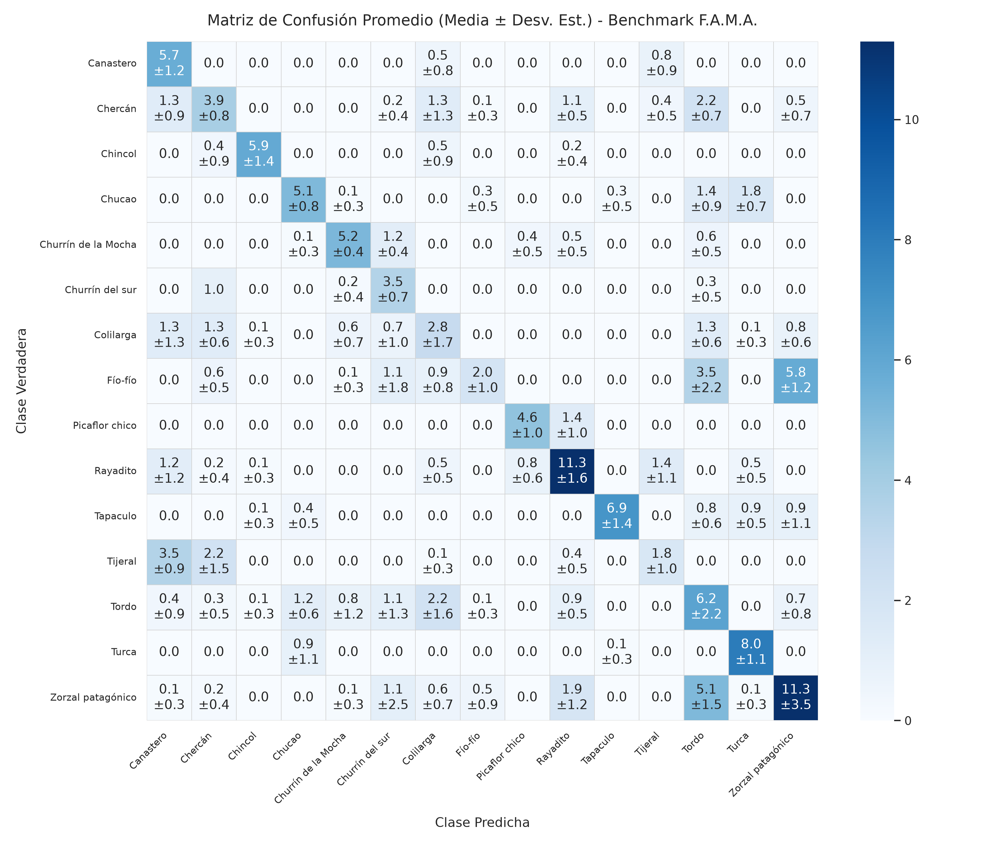

# Problema Conocido 01: Solapamiento Acústico y Confusión Sistemática entre Clases

**Proyecto:** Framework MLOps Híbrido para Clasificación de Audio (F.A.M.A.)  
**Fecha:** Septiembre 2026  
**Área:** Diagnóstico Bioacústico, Geometría del Espacio Latente y Separabilidad de Clases  
**Dominio:** 15 Especies de Aves de Chile (Dataset Xeno-canto v3)  
**Evidencia Empírica:** Matriz de Confusión Promedio de Benchmark Multicorrida ($N=10$)  
**Estado:** Problema Caracterizado e Identificado como Límite Estructural  

---

## 1. Naturaleza del Problema: Falta de Separabilidad Bioacústica

En problemas de clasificación supervisada, se asume con frecuencia que si el entrenamiento converge con una pérdida decreciente, el modelo está adquiriendo la capacidad de discriminar entre todas las categorías del dataset. Sin embargo, en la clasificación bioacústica de F.A.M.A., el modelo base (`AudioCNN`, 4 capas convolucionales) exhibe una patología fundamental: **incapacidad geométrica para separar ciertas clases cuyos patrones espectrales se solapan**.

### La Analogía Formal: El "Efecto Flores" (Dataset Iris de Fisher)
Este comportamiento es análogo al caso canónico del dataset *Iris*:
* **Clase aislada:** *Iris Setosa* está completamente distanciada en el espacio de características, alcanzando $100\%$ de precisión sin importar la semilla.
* **Clases solapadas:** *Iris Versicolor* e *Iris Virginica* comparten rangos dimensionales continuos de pétalos. La frontera de decisión se ubica arbitrariamente según la inicialización aleatoria de pesos o el orden de minilotes, provocando que en una ejecución una clase obtenga $70\%$ y en otra $40\%$.

En F.A.M.A., el benchmark de 10 ejecuciones independientes demostró que **no se trata de variabilidad aleatoria global** ($\sigma = \pm 2.67\%$ en Accuracy), sino de un **solapamiento bioacústico real** entre especies específicas que la arquitectura actual no puede desenredar.

```text
       ┌──────────────────────────────────────────────────────────┐
       │     ESPACIO LATENTE: SEPARABILIDAD VS SOLAPAMIENTO       │
       └──────────────────────────────────────────────────────────┘

         [ Chincol ]             [ Turca ]           [ Tapaculo ]
        (Aislado, >85% F1)   (Aislado, >78% F1)   (Aislado, >78% F1)
              ●                     ▲                     ■
              ●●                   ▲▲                     ■■
              
                           ZONA DE SOLAPAMIENTO CRÓNICO
                   ┌────────────────────────────────────────┐
                   │    Chucao  ≈≈≈≈≈>  Turca               │
                   │    Tijeral ≈≈≈≈≈>  Canastero           │
                   │    Fío-fío =====>  Zorzal + Tordo      │
                   │    Colilarga ≈≈≈>  Dispersión          │
                   └────────────────────────────────────────┘
```

---

## 2. Evidencia Empírica: Matriz de Confusión Promedio ($N=10$)

A partir de 10 entrenamientos y evaluaciones consecutivas sobre el conjunto de prueba fijo (154 muestras estratificadas, ~10 por especie), se consolidó la matriz de confusión promedio:



### Resumen de F1-Score y Grado de Separabilidad por Especie:

| Especie | F1-Score Promedio ($\mu \pm \sigma$) | Aciertos ($\mu \pm \sigma$) | Total Test | Grado de Separabilidad |
|:---|:---:|:---:|:---:|:---|
| **Chincol** | **87.42% ± 12.39%** | $5.9 \pm 1.4$ | 7 | **Excelente:** Firma espectral única aislada |
| **Tapaculo** | **78.89% ± 9.36%** | $6.9 \pm 1.4$ | 9 | **Alta:** Ritmo y cadencia percusiva distintiva |
| **Turca** | **78.11% ± 5.13%** | $8.0 \pm 1.1$ | 9 | **Alta:** Registro vocal potente de frecuencia media |
| **Picaflor chico** | **77.39% ± 10.77%** | $4.6 \pm 1.0$ | 6 | **Alta:** Chirridos ultrasónicos muy agudos |
| **Churrín de la Mocha** | **70.37% ± 7.50%** | $5.2 \pm 0.4$ | 8 | **Moderada-Alta:** Leve cruce con Churrín del sur |
| **Rayadito** | **67.06% ± 6.97%** | $11.3 \pm 1.6$ | 15 | **Moderada:** Confusiones aisladas con Tijeral |
| **Chucao** | **60.95% ± 4.11%** | $5.1 \pm 0.8$ | 9 | **Solapamiento sistemático** con Turca |
| **Canastero** | **57.00% ± 11.00%** | $5.7 \pm 1.2$ | 7 | **Solapamiento activo:** Absorbe muestras de Tijeral |
| **Churrín del sur** | **56.99% ± 18.32%** | $3.5 \pm 0.7$ | 5 | **Inestable:** Cruces con Churrín de la Mocha |
| **Zorzal patagónico** | **53.62% ± 10.42%** | $11.3 \pm 3.5$ | 21 | **Fuga masiva:** Confusión recurrente hacia Tordo |
| **Chercán** | **37.01% ± 6.96%** | $3.9 \pm 0.8$ | 10 | **Baja:** Dispersión en Canastero, Tijeral y Tordo |
| **Tordo** | **34.25% ± 8.26%** | $6.2 \pm 2.2$ | 13 | **Clase Sumidero:** Recibe falsos positivos cruzados |
| **Colilarga** | **28.28% ± 13.67%** | $2.8 \pm 1.7$ | 9 | **Colapso:** Predicciones repartidas en 6 especies |
| **Tijeral** | **27.48% ± 13.72%** | $1.8 \pm 1.0$ | 8 | **Canibalizado:** Mayoritariamente predicho como Canastero |
| **Fío-fío** | **22.50% ± 8.21%** | $2.0 \pm 1.0$ | 13 | **Colapso Total:** Predicho como Zorzal y Tordo |

---

## 3. Tipología de Solapamientos Inter-Especie Identificados

El análisis detallado de la matriz permite tipificar tres patrones de solapamiento que operan simultáneamente en el dataset:

### 3.1. Canibalización Taxonómica (Similitud Filogenética y Morfológica)
Ocurre entre especies biológicamente emparentadas que comparten aparatos fonadores (siringe) similares y emiten vocalizaciones en rangos de frecuencia idénticos:

1. **Tijeral (*Aphrastura spinicauda*) vs Canastero (*Asthenes humicola*):**
   * **Familia:** *Furnariidae*.
   * **Diagnóstico:** De las 8 muestras verdaderas de Tijeral, el modelo solo acierta **$1.8 \pm 1.0$**. En cambio, clasifica sistemáticamente **$3.5 \pm 0.9$ muestras como Canastero** y **$2.2 \pm 1.5$ como Chercán**.
   * **Causa acústica:** Ambas especies emiten trinos modulados en frecuencias agudas ($4\text{ kHz} - 8\text{ kHz}$) con patrones de ráfaga muy cercanos. La red no logra aprender la micro-duración entre pulsos que las diferencia en campo.

2. **Chucao (*Scelorchilus rubecula*) vs Turca (*Pteroptochos megapodius*):**
   * **Familia:** *Rhinocryptidae*.
   * **Diagnóstico:** Mientras la Turca es clasificada con precisión casi perfecta ($8.0 \pm 1.1$ aciertos de 9), el Chucao sufre una fuga constante hacia la Turca (**$1.8 \pm 0.7$ muestras predichas como Turca**).
   * **Causa acústica:** Ambas especies vocalizan en estratos bajos de vegetación densa con frecuencias graves a medias ($1\text{ kHz} - 3\text{ kHz}$) y resonancia ambiental. La red confunde la silueta de los formantes de Chucao con la firma más marcada y enérgica de la Turca.

3. **Churrín del sur (*Scytalopus magellanicus*) vs Churrín de la Mocha (*Scytalopus opalifrons*):**
   * **Género:** *Scytalopus*.
   * **Diagnóstico:** Confusiones cruzadas bidireccionales permanentes. El Churrín de la Mocha fuga **$1.2 \pm 0.4$ muestras hacia el Churrín del sur**, y el Churrín del sur presenta una desviación estándar extrema ($\pm 18.32\%$), demostrando que la frontera entre ambos es inestable.

---

### 3.2. Clases Sumidero (*Sink Classes*): Fío-fío, Tordo y Zorzal
En modelos con capas convolucionales poco profundas, cuando una muestra ambigua no activa fuertemente los filtros de ninguna clase específica, la red tiende a proyectar la probabilidad hacia clases que actúan como "atractoras":

```text
                  ┌────────────────────────────────────────┐
                  │    MECANISMO DE LA CLASE SUMIDERO      │
                  └────────────────────────────────────────┘

    Muestras de [ Fío-fío ] (13 totales)
            │
            ├──>  2.0 ± 1.0 aciertos  ─────> [ Fío-fío ] (Solo 15.4% de éxito)
            │
            ├──>  5.8 ± 1.2 muestras  ─────> [ Zorzal patagónico ] (Sumidero primario)
            │
            └──>  3.5 ± 2.2 muestras  ─────> [ Tordo ]             (Sumidero secundario)
```

* **El Colapso del Fío-fío ($22.50\%$ F1):**
  El Fío-fío (*Elaenia albiceps*) tiene un silbido característico y breve ("fío-fío"). Sin embargo, en las grabaciones de campo suele venir acompañado de viento, eco o cantos secundarios de fondo. Al procesar el espectrograma, la red no detecta una textura densa y asigna **$5.8 \pm 1.2$ muestras al Zorzal** y **$3.5 \pm 2.2$ al Tordo**, dejándolo con una tasa de acierto marginal de apenas $15.4\%$.
* **El Tordo como Atractor Universal:**
  La columna predicha de *Tordo* acumula errores de prácticamente todo el dataset:
  * $5.1 \pm 1.5$ muestras de Zorzal patagónico se predicen como Tordo.
  * $3.5 \pm 2.2$ muestras de Fío-fío se predicen como Tordo.
  * $2.2 \pm 0.7$ muestras de Chercán se predicen como Tordo.
  * $1.4 \pm 0.9$ muestras de Chucao se predicen como Tordo.
  * $1.3 \pm 0.6$ muestras de Colilarga se predicen como Tordo.

---

### 3.3. Dispersión Entrópica (*Colilarga*)
A diferencia de los dos casos anteriores donde el error es direccional (A se confunde con B), la *Colilarga* (*Sylviorthorhynchus desmursii*) sufre **dispersión entrópica**:
* De 9 muestras de prueba, solo acierta $2.8 \pm 1.7$.
* El resto de muestras se distribuye de manera casi uniforme entre Canastero ($1.3$), Chercán ($1.3$), Churrín ($0.7$), Tordo ($1.3$) y Zorzal ($0.8$).
* **Diagnóstico:** La red simple no logró aprender una representación invariante para la Colilarga; sus predicciones se rigen casi por azar frente al ruido de fondo de las grabaciones.

---

## 4. Razones por las que Más Épocas o Regularización no Resuelven el Problema

Es un error común en ingeniería de ML intentar resolver este solapamiento incrementando el número de épocas de entrenamiento o forzando técnicas de regularización adicionales (Dropout, Weight Decay) sobre la misma arquitectura. Los motivos teóricos que lo impiden son:

1. **Inseparabilidad en el Espacio de Entrada:**
   Un espectrograma Mel estándar con `n_mels=64` proyecta frecuencias de $0$ a $11.025\text{ Hz}$ en solo 64 contenedores logarítmicos. En las bandas altas ($>4\text{ kHz}$), la resolución espectral es de varios cientos de Hertz por contenedor. La diferencia tímbrica entre un Tijeral y un Canastero queda comprimida en 1 o 2 celdas contiguas; para la red, **las entradas son numéricamente casi indistinguibles**.
2. **Límite de Profundidad y Campo Receptivo:**
   `AudioCNN` cuenta con 4 capas con kernels $3\times3$. No posee capas con dilatación temporal (*dilated convolutions*) ni capas densas residuales para captar relaciones armónicas armadas a lo largo de toda la ventana temporal (3 segundos). La red solo "ve" parches locales de textura.
3. **Sobreajuste de Memorización (*Overfitting* Local):**
   Si se incrementan las épocas a 30 o 50, la pérdida de entrenamiento descenderá hacia cero, pero el modelo simplemente memorizará los ruidos de fondo específicos de las grabaciones de entrenamiento de Tijeral o Fío-fío, empeorando su capacidad de generalización en validación y test.

---

## 5. Estrategias Focalizadas para Desacoplar las Clases Solapadas

Para romper la barrera del solapamiento bioacústico entre estas especies sin degradar el rendimiento de las clases que ya funcionan bien, se establecen las siguientes soluciones técnicas:

### 1. Extracción con Backbones Bioacústicos Preentrenados (*Transfer Learning*)
* **Mecanismo:** Emplear modelos entrenados sobre millones de vocalizaciones de aves (ej. **Google Perch** o **BirdNET**) o redes convolucionales profundas con atención (**EfficientNet-B0**).
* **Impacto esperado:** Estos modelos proyectan el audio en espacios de *embeddings* de 1.024 dimensiones donde especies taxonómicamente emparentadas como *Tijeral/Canastero* o *Chucao/Turca* ya están geométricamente separadas gracias a su entrenamiento masivo previo.

### 2. Modulación de Pérdida Penalizada (Focal Loss y Class Weights)
* **Mecanismo:** Modificar la función de coste para castigar fuertemente los errores en las clases canibalizadas:
  $$\mathcal{L}_{\text{Focal}} = -\alpha_t (1 - p_t)^\gamma \log(p_t)$$
* **Impacto esperado:** Al elevar $\gamma$ ($= 2.0$), la pérdida ignora las muestras fáciles (como *Chincol* o *Turca*) y enfoca la actualización de gradientes exclusivamente en los límites de decisión confusos (*Fío-fío*, *Tijeral*), desincentivando además que la red use a *Tordo* como sumidero seguro.

### 3. Aumento de Resolución del Front-End a 128 Bandas Mel
* **Mecanismo:** Duplicar la resolución vertical (`n_mels=128`) y acotar el rango de análisis (`f_min=800 Hz`, `f_max=10000 Hz`).
* **Impacto esperado:** Descomprime los armónicos de alta frecuencia, otorgando a los filtros convolucionales la granularidad necesaria para distinguir la cadencia del Tijeral frente al Canastero.
