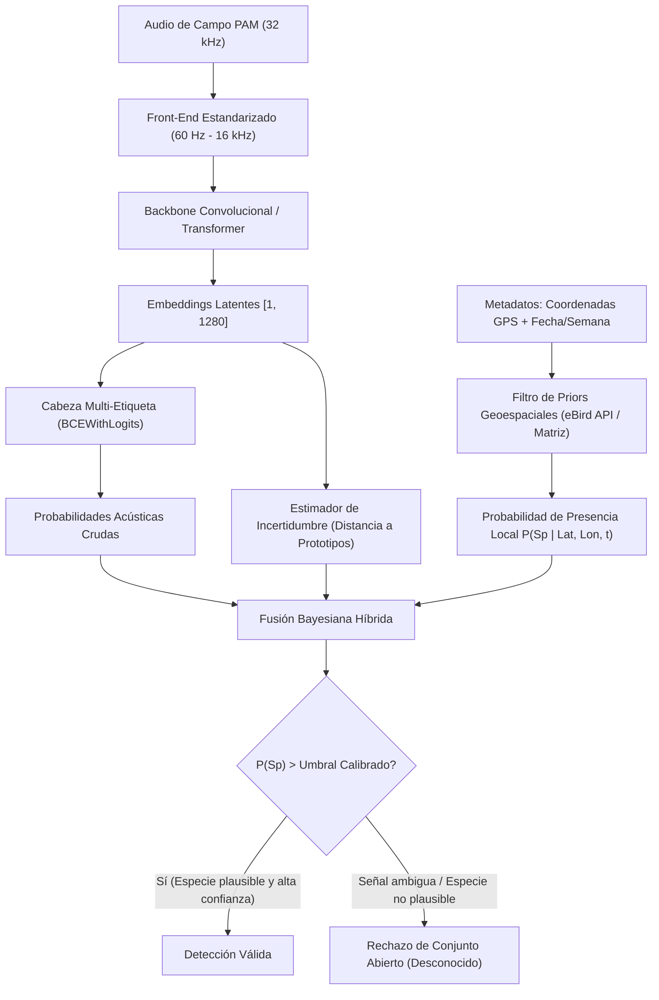

# Problema Conocido 02: Límites de la Generalización Universal, Brecha Focal-PAM y Reconocimiento en Conjunto Abierto

**Proyecto:** Framework MLOps Híbrido para Clasificación de Audio (F.A.M.A.)  
**Fecha:** Septiembre 2026  
**Área:** Arquitectura de Aprendizaje Estadístico, Ecología Acústica y Despliegue en Borde (*Edge PAM*)  
**Dominio:** Clasificación Bioacústica y Transición de F.A.M.A. hacia Escala Global  
**Estado:** Límite Estructural Documentado y Guía Arquitectónica para Futuros Datasets  

---

## 1. Naturaleza del Problema: La Falacia del "Clasificador Ciego Universal"

Un error recurrente en el diseño de sistemas de visión y audio computacional consiste en asumir que un modelo convolucional de alto rendimiento en un dominio cerrado (como el récord de **88.68% Macro F1** alcanzado por F.A.M.A. sobre 15 especies chilenas) puede extenderse trivialmente a "cualquier especie" sin alterar los fundamentos matemáticos de su arquitectura.

Pretender que una única red neuronal cerrada clasifique con alta precisión las más de **10.500 especies de aves del planeta** sobre un dispositivo de borde (*edge*) es teórica y fácticamente inviable. Este documento formaliza los cuatro límites estructurales que impiden dicha generalización ciega y establece la arquitectura requerida para abordarla al migrar a nuevos datasets.

---

## 2. Los Cuatro Límites Estructurales de la Generalización Bioacústica

### 2.1 El Colapso de la Función Softmax en Conjunto Abierto (*Open-Set Recognition*)
* **La Patología Matemática:**  
  La capa final de un clasificador cerrado aplica la normalización exponencial Softmax sobre un vocabulario cerrado de $K$ clases:
  $$P(y = c \mid \mathbf{x}) = \frac{\exp(z_c)}{\sum_{j=1}^K \exp(z_j)}$$
  Por definición matemática, $\sum_{c=1}^K P(y = c \mid \mathbf{x}) \equiv 1.0$.
* **Consecuencia en Campo:**  
  Cuando el dispositivo en el bosque captura un sonido ajeno al vocabulario cerrado (una especie de ave no catalogada, un anfibio, lluvia sobre el micrófono, ramas quebrandose o una motosierra), el modelo **está matemáticamente forzado a repartir el 100% de la probabilidad entre sus clases conocidas**. Esto genera **alucinaciones con sobreconfianza catastrófica**, destruyendo la validez ecológica de los reportes.

```text
               ENTRADA ACÚSTICA                      SALIDA DE RED CERRADA (K=15)
     ┌───────────────────────────────────┐               ┌───────────────────────────────┐
     │  Especie Exótica / Lluvia / Rana  │ ────────────> │  Fío-fío: 87% (¡Alucinación!) │
     │        (Fuera del Vocabulario)    │   (Softmax)   │  Zorzal:  11%                 │
     └───────────────────────────────────┘               └───────────────────────────────┘
```

---

### 2.2 La Brecha entre Grabaciones Focales y Monitoreo Acústico Pasivo (Focal $\to$ PAM Gap)
Existe un abismo metodológico y físico entre los datos de laboratorio y el despliegue en campo:

| Dimensión | Grabación Focal de Aficionado (Xeno-canto v3) | Monitoreo Acústico Pasivo en Campo (PAM) |
| :--- | :--- | :--- |
| **Metodología de Captura** | Humano apuntando un micrófono parabólico o *shotgun* directamente al ave a corta distancia (2–5 m). | Grabador autónomo omnidireccional (*AudioMoth / Swift*) atado a un árbol durante 30–60 días continuos. |
| **Relación Señal-Ruido (SNR)** | Alta ($>20\text{ a }30\text{ dB}$). Fondo limpio, canto dominante nítido. | Muy baja a moderada ($-5\text{ a }+10\text{ dB}$). Canto distante mezclado con turbulencia. |
| **Composición Acústica** | **Single-Label:** Prácticamente 1 sola especie emitiendo sonido relevante. | **Soundscape Complejo:** 3 a 6 especies cantando al mismo tiempo, insectos continuos a 6–8 kHz y viento. |
| **Formulación de Pérdida** | Softmax multi-clase exclusiva (válida en F.A.M.A. PoC). | **Incompatible con Softmax:** Obliga a clasificación multi-etiqueta no excluyente (`BCEWithLogitsLoss`). |

Evaluar directamente un modelo entrenado con Softmax sobre grabaciones focales frente a paisajes sonoros de monitoreo pasivo (como los de *BirdSet* o *BEANS*) genera una degradación severa de desempeño si no se desacopla la cabeza de clasificación.

---

### 2.3 Desalineamiento Físico de Muestreo y Frecuencia (22.05 kHz vs 32 kHz)
* **Decisión Local de F.A.M.A.:**  
  Para optimizar el uso de VRAM en la GPU móvil (4 GB) y acelerar el entrenamiento a 4.5 minutos, F.A.M.A. estandarizó el audio a $22.050\text{ Hz}$ ($f_{\text{Nyquist}} = 11.025\text{ Hz}$) y recortó el banco Mel al rango $800\text{ Hz} - 10.000\text{ Hz}$ ([`backend/poc/preprocess.py`](../../backend/poc/preprocess.py)).
* **Estándar Global de Modelos Fundacionales (Perch 2.0, BirdNET):**  
  Los modelos fundacionales de Google Research (*Perch-v2*, EfficientNet-B3) y BirdNET estandarizan el procesamiento a **$32.000\text{ Hz}$** ($f_{\text{Nyquist}} = 16.000\text{ Hz}$) cubriendo el rango biológico completo de **$60\text{ Hz}$ a $16.000\text{ Hz}$**.
* **El Problema de "Ceguera Espectral":**  
  Si se intenta destilar conocimiento (*Knowledge Distillation / CMKD*) desde Perch-v2 hacia el modelo de F.A.M.A. sin re-estandarizar el pipeline a 32 kHz, el modelo alumno sufre una asimetría física insalvable: no puede modelar los armónicos agudos (10 a 16 kHz) que el maestro utiliza para discriminar paseriformes y colibríes.

---

### 2.4 La Rigidez de Formantes y el Fallo de Augmentation Tonal Sintético
* Como quedó demostrado en el experimento del [ADR 0009](../adr/0009_pitch_shift_espectral_gpu_augmentation.md) e [Informe 14](../14_pitch_shift_espectral_gpu_rdd.md), la traslación tonal sintética (*Pitch Shift* de $\pm 1$ semitono) provocó una caída de Macro F1 de **88.44% a 83.71%**.
* **Causa Biológica:** En la avifauna paseriforme (especialmente suboscinas como *Scytalopus* o *Sylviorthorhynchus*), los individuos emiten silbidos y trinos en **formantes de frecuencia rígidos y de ancho de banda ultra-estrecho**. Alterar artificialmente la frecuencia fundamental destruye la firma diagnóstica, induciendo a la red a confundir especies que cohabitan en frecuencias adyacentes.

---

## 3. Arquitectura Requerida para Reentrenamiento en Nuevos Datasets

Cuando el proyecto F.A.M.A. expanda su alcance hacia datasets más amplios (e.g. 50–200 especies del Neotrópico o soundscapes PAM), la solución no es incrementar ciegamente el número de salidas de la capa lineal, sino implementar una **arquitectura de sistema híbrida**:



### Pilares de la Solución de Producción:
1. **Priors Geoespaciales y Fenológicos:** Reducir el espacio de hipótesis activo desde miles de aves a las 30–60 especies que realmente habitan la zona geográfica y temporada de grabación (el principio utilizado por *Merlin Bird ID*).
2. **Formulación Multi-Etiqueta (`BCEWithLogitsLoss`):** Permitir la detección concurrente de múltiples especies en la misma ventana temporal de 5 segundos.
3. **Opción de Rechazo de Conjunto Abierto (*Open-Set Reject*):** Abstenerse de predecir cuando la distancia en el espacio latente a los prototipos conocidos sea excesiva, etiquetando el evento como `Indeterminado` para revisión experta.
4. **Estandarización a 32 kHz:** Alinear el sample rate para habilitar destilación offline desde modelos fundacionales como *Perch-v2*.

---

## 4. Conclusión

El ensamble heterogéneo actual de F.A.M.A. (**88.68% F1 en 15 especies chilenas**) representa el óptimo matemático para su dominio cerrado de diseño. 

Para abordar un nuevo dataset a mayor escala, el trabajo futuro no debe buscar "estirar" el clasificador cerrado actual, sino **reentrenar bajo la formulación multi-etiqueta a 32 kHz asistida por priors geoespaciales y filtros de conjunto abierto**.
