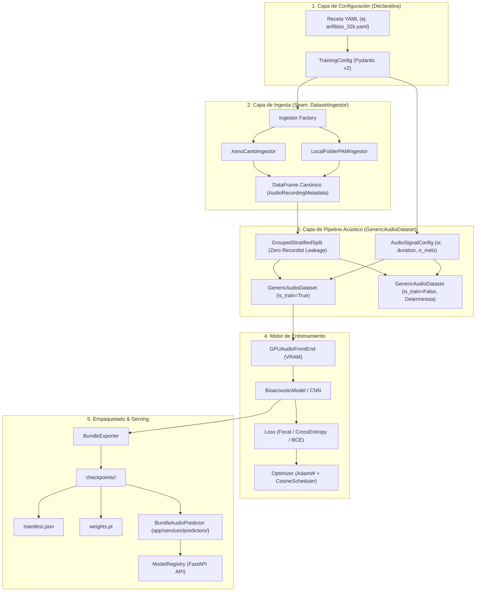
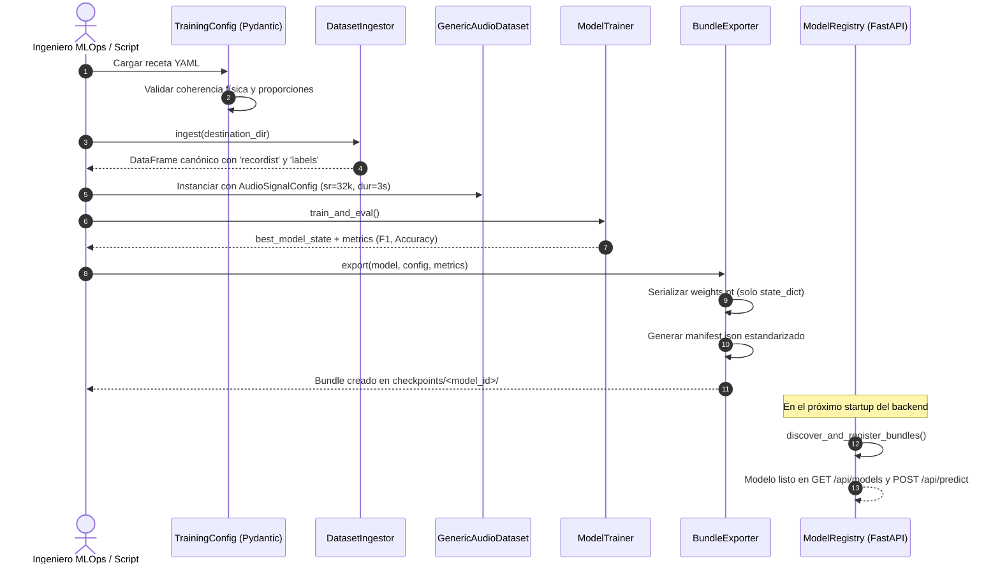

# Documento de Diseño Técnico: Subsistema Modular de Entrenamiento y Empaquetado de Modelos

**Cambio:** `2026-09-15-modular-training-subsystem`  
**Estado:** Diseñado  
**Fecha:** 2026-09-15  

---

## 1. Visión General de la Arquitectura

El diseño aplica estrictamente el principio de **Módulos Profundos** (*Deep Modules*): interfaces pequeñas y estables que ocultan alta complejidad interna. El subsistema desacopla la variabilidad de los datos, la física del audio, el bucle de optimización y la serialización del artefacto.

---

## 2. Diagrama de Secuencia: Ciclo de Ingesta, Entrenamiento y Despliegue

---

## 3. Especificación de Interfaces y Módulos Profundos

### 3.1 Módulo `DatasetIngestor` (`backend/training/datasets/`)
* **Interfaz:** `ingest(destination_dir: Path, force_refresh: bool = False) -> pd.DataFrame`
* **Profundidad:** Oculta llamadas HTTP, reintentos con backoff exponencial, cálculos de hash SHA-256, parseo de árboles de directorios y consolidación de anotaciones multi-etiqueta.
* **Salida Normalizada:**
  Columnas requeridas: `[nombre_archivo, file_path, clase, labels, recordist, duracion_segundos, tamano_bytes]`.

### 3.2 Módulo `GenericAudioDataset` (`backend/training/pipelines/`)
* **Interfaz:** `__init__(df, audio_config, vad_config, aug_config, is_train, multilabel)` y `__getitem__(idx) -> (Tensor, Tensor)`
* **Profundidad:**
  - Desacopla la tasa de muestreo (`target_sr` arbitrario: 22050, 32000, 44100 Hz).
  - Encapsula el ventaneo VAD en CPU con fallback determinista en evaluación.
  - Genera etiquetas escalares (`torch.long`) para single-label o vectores multi-hot (`torch.float32`) para multi-label sin tocar el código consumidor.

### 3.3 Módulo `BundleExporter` (`backend/training/exporters/`)
* **Interfaz:** `export(output_dir: Path, model: nn.Module, config: TrainingConfig, metrics: Dict[str, Any]) -> Path`
* **Profundidad:**
  - Extrae el `state_dict` limpio (usando `weights_only=True` compatible).
  - Mapea las especificaciones de `TrainingConfig` al esquema `ModelManifest`.
  - Exporta una copia exacta de la receta para trazabilidad y auditoría.

### 3.4 Módulo `BundleAudioPredictor` (`backend/app/services/predictors/`)
* **Interfaz:** Hereda de `AudioPredictor` (`predict(audio_file_path: Path) -> PredictionResult`).
* **Profundidad:**
  - Lee el `manifest.json` e instancia dinámicamente la arquitectura correcta (`BioacousticModel` o `AudioCNN`) y el preprocesamiento con las bandas Mel y frecuencias de corte especificadas en el manifiesto.
  - Implementa *lazy loading* para no consumir VRAM hasta la primera llamada de inferencia.

---

## 4. Decisiones Técnicas y Justificación

| Decisión | Alternativa Rechazada | Justificación Arquitectónica |
| :--- | :--- | :--- |
| **Pydantic v2 para Configuración** | `argparse` / diccionarios crudos | Validación estricta en tiempo de carga, detección temprana de errores de tipos y documentación automática de esquemas. |
| **Manifest JSON desacoplado** | Cargar objetos Python serializados (`pickle`) | `pickle` genera riesgos severos de seguridad (inyección de código) y acopla el código del cliente a la versión de las clases internas. JSON es interoperable, seguro e inspeccionable. |
| **Separación de `weights.pt` y `metadata.json`** | Guardar todo dentro del diccionario del checkpoint de PyTorch | Permite que `GET /api/models` y el catálogo lean los metadatos de 50 modelos en microsegundos sin cargar gigabytes de tensores en memoria. |
| **Particionado Multi-label Grouped** | `train_test_split` aleatorio simple | Garantiza **Zero Recordist Leakage** evitando que audios del mismo grabador o estación de monitoreo aparezcan en train y test a la vez. |

---

## 5. Medidas de Seguridad y Mitigación de Riesgos

1. **Invarianza de la PoC:** Ningún archivo de `backend/poc/` será modificado o renombrado. Las suites de pruebas existentes corren independientemente.
2. **Tolerancia a Bundles Corruptos:** `discover_and_register_bundles()` utiliza bloques `try/except` por directorio. Si un usuario introduce un `manifest.json` mal formado, se registra una advertencia y el resto del backend opera con normalidad.
3. **Aislamiento de Persistencia GCS:** La inferencia sobre bundles exportados mantiene el mismo contrato previo: validación temprana y subida a GCS antes de inferir.
